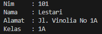
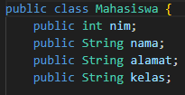
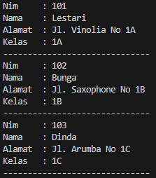

# Laporan Praktikum Pertemuan 2

# Jobsheet 2: Class dan Object

## Data Mahasiswa

Nama : Chamillatul Luqiana Agustin

Nim : 2241720020

Kelas : TI-2C

# 4. Percobaan

## 4.1 Percobaan 1: Membuat Class Diagram

Studi Kasus 1:

Dalam suatu perusahaan salah satu data yang diolah adalah data karyawan. Setiap karyawan memiliki id, nama, jenis kelamin, jabatan, jabatan, dan gaji. Setiap mahasiswa juga bisa menampilkan data diri pribadi dan melihat gajinya.

1. Gambarkan desain class diagram dari studi kasus 1!

   **Jawaban:**

    

2. Sebutkan Class apa saja yang bisa dibuat dari studi kasus 1!

   **Jawaban:**

   Ada 2 class yang bisa dibuat sari studi kasus 1:

   - Class Karyawan

   - Class KaryawanMain

3. Sebutkan atribut beserta tipe datanya yang dapat diidentifikasi dari masing-masing class dari studi kasus 1!

   **Jawaban:**

   - Class Karyawan:

     - id(int)
     - nama(String)
     - jenisKelamin(String)
     - jabatan(String)
     - gaji(double)

4. Sebutkan method-method yang sudah anda buat dari masing-masing class pada studi kasus 1!

   **Jawaban:**

   - Class Karyawan

     - tampilData(): void

       Dalam method ini akan menampilkan data diri karyawan seperti id, nama, jenis kelamin, jabatan, dan gaji.

     - lihatGaji(): double

       Dalam method ini akan mengembalikan nilai gaji karyawan.

**KODE PROGRAM**

```java
public class Karyawan {
    // Atribut
    public int id;
    public String nama;
    public String jenisKelamin;
    public String jabatan;
    public double gaji;

    // Method menampilkan data diri
    public void tampilkanDataDiri() {
        System.out.println("ID\t\t: " + id);
        System.out.println("Nama\t\t: " + nama);
        System.out.println("Jenis Kelamin\t: " + jenisKelamin);
        System.out.println("Jabatan\t\t: " + jabatan);
        System.out.println("Gaji\t\t: " + gaji);
    }

    // Metode melihat gaji
    public double lihatGaji() {
        return gaji;
    }
}
```

```java
public class KaryawanMain {
    public static void main(String[] args) {
        // Objek Karyawan
        Karyawan karyawan1 = new Karyawan();
        karyawan1.id = 1234;
        karyawan1.nama = "Adinda Ayu";
        karyawan1.jenisKelamin = "Perempuan";
        karyawan1.jabatan = "Manager";
        karyawan1.gaji = 5500000;

        // Menampilkan data diri karyawan
        System.out.println("================================");
        System.out.println("\tDATA KARYAWAN\t");
        System.out.println("================================");
        karyawan1.tampilkanDataDiri();

        // Melihat gaji karyawan
        double gajiKaryawan1 = karyawan1.lihatGaji();
        System.out.println("--------------------------------");
        System.out.println("Gaji Karyawan\t: " + gajiKaryawan1);
    }
}
```


**OUTPUT**


## 4.2 Percobaan 2: Membuat dan mengakses anggota suatu class

Stdi Kasus 2:

Perhatikan class diagram dibawah ini. Buatlah program berdasarkan class diagram tersebut!

 

### Langkah kerja:
1. Bukalah text editor atau IDE, misalnya Notepad ++ / netbeans.
2. Ketikkan kode program berikut ini:
    
    ```java
    public class Mahasiswa {
        public int nim;
        public String nama;
        public String alamat;
        public String kelas;

        public void tampilBiodata() {
            System.out.println("Nim     : " + nim);
            System.out.println("Nama    : " + nama);
            System.out.println("Alamat  : " + alamat);
            System.out.println("Kelas   : " + kelas);
        }
    }
    ```
3. Simpan dengan nama file Mahasiswa.java.
4. Untuk dapat mengakses anggota-anggota dari suatu obyek, maka harus dibuat instance dari class tersebut terlebih dahulu. Berikut ini adalah cara pengaksesan anggota-anggota dari class Mahasiswa dengan membuka file baru kemudian ketikkan kode program berikut:
    ```java
    public class TestMahasiswa {
      public static void main(String[] args) {
          Mahasiswa mhs1 = new Mahasiswa();
          mhs1.nim = 101;
          mhs1.nama = "Lestari";
          mhs1.alamat = "Jl. Vinolia No 1A";
          mhs1.kelas = "1A";
         mhs1.tampilBiodata();
      }
    }
    ```

5. Simpan file dengan TestMahasiswa.java
6. Jalankan class TestMahasiswa

    **OUTPUT:**

    
    
7. Jelaskan pada bagian mana proses pendeklarasian atribut pada program diatas!

    **Jawaban:**
    
    Proses pendeklarasian atribut terjadi di dalam kelas Mahasiswa. Atribut-atribut tersebut adalah:
    
    * nim (tipe: int)

    * nama (tipe: String)

    * alamat (tipe: String)

    * kelas (tipe: String)

    Berikut ini bagian dari proses pendeklarasian atribut pada program
    
    

8. Jelaskan pada bagian mana proses pendeklarasian method pada program diatas!

    **Jawaban:**

    Proses pendeklarasian method terjadi di dalam kelas Mahasiswa. Method yang dideklarasikan adalah “tampilBiodata()”, yang merupakan method tanpa parameter dan tanpa nilai kembalian (void). Method ini digunakan untuk mencetak informasi biodata mahasiswa ke layar.

    Berikut ini bagian dari proses pendeklarasian method pada program
    
    

9. Berapa banyak objek yang di instansiasi pada program diatas!

    **Jawaban:**

    Terdapat satu objek yang di instansiasi, yaitu “mahasiswa” diiinstansuasu dengan nama “mhs1”.

    Berikut ini bagian dari objek yang di instansiasi pada program
    
    

10. Apakah yang sebenarnya dilakukan pada sintaks program “mhs1.nim=101” ?

    **Jawaban:**

     Sintaks “mhs1.nim = 101” menginisialisasi nilai atribut nim dari objek “mhs1” dengan nilai 101, yang dimana objek “mhs1” sekarang memiliki atribut “nim” dengan nilai 101.
11. Apakah yang sebenarnya dilakukan pada sintaks program “mhs1.tampilBiodata()”?

    **Jawaban:**

    Sintaks “mhs1.tampilBiodata()” memanggil method “tampilBiodata()” pada objek “mhs1”. Saat method ini dipanggil, ia mencetak informasi biodata (nim, nama, alamat, dan kelas) objek “mhs1” ke layar.
12. Instansiasi 2 objek lagi pada program diatas!

    **Jawaban:**

    Dengan menambahkan “mhs2” dan “mhs3” masing-masing dengan atribut-atribut yang berbeda pada class TestMahasiswa.

    ```java
    public class TestMahasiswa {
      public static void main(String[] args) {
        Mahasiswa mhs1 = new Mahasiswa();
        mhs1.nim = 101;
        mhs1.nama = "Lestari";
        mhs1.alamat = "Jl. Vinolia No 1A";
        mhs1.kelas = "1A";
        mhs1.tampilBiodata();
        System.out.println("------------------------------");

        Mahasiswa mhs2 = new Mahasiswa();
        mhs2.nim = 102;
        mhs2.nama = "Bunga";
        mhs2.alamat = "Jl. Saxophone No 1B";
        mhs2.kelas = "1B";
        mhs2.tampilBiodata();
        System.out.println("------------------------------");
    
        Mahasiswa mhs3 = new Mahasiswa();
        mhs3.nim = 103;
        mhs3.nama = "Dinda";
        mhs3.alamat = "Jl. Arumba No 1C";
        mhs3.kelas = "1C";
        mhs3.tampilBiodata();
        System.out.println("------------------------------");
      }
    }
    ```

    **OUTPUT**

    

## 4.3 Percobaan 3: Menulis method yang memiliki argument/parameter dan memiliki return

### Langkah kerja:
1. Bukalah text editor atau IDE, misalnya Notepad ++ / netbeans.
2. Ketikkan kode program berikut ini:

    ```java
    public class Barang {
        public String namaBrg;
        public String jenisBrg;
        public int stok;

        public void tampilBarang() {
            System.out.println("Nama Barang    : " + namaBrg);
            System.out.println("Jenis Barang   : " + jenisBrg);
            System.out.println("Stok           : " + stok);
        }

        // method dengan argumen dan nilai balik (return)
        public int tambahStok(int brgMasuk) {
            int stokBaru = brgMasuk + stok;
            return stokBaru;
        }
    }
    ```  
3. Simpan dengan nama file Barang.java
4. Untuk dapat mengakses anggota-anggota dari suatu obyek, maka harus dibuat instance dari class tersebut terlebih dahulu. Berikut ini adalah cara pengaksesan anggota-anggota dari class Barang dengan membuka file baru kemudian ketikkan kode program berikut:
    ```java
    public class TestBarang {
        public static void main(String[] args) {
            Barang brg1 = new Barang();
            brg1.namaBrg = "Pensil";
            brg1.jenisBrg = "ATK";
            brg1.stok = 10;
            brg1.tampilBarang();
          
            // menampilkan dan mengisi argumen untuk menambahkan stok barang
            System.out.println("---------------------------");
            System.out.println("Stok baru adalah " + brg1.tambahStok(20));
        }
    }
    ``` 
5. Simpan dengan nama file TestBarang.java
6. Jalankan program tersebut!

    **OUTPUT**

    
    
7. Apakah fungsi argumen dalam suatu method?

    **Jawaban:**

    Fungsi argument dalam suatu method adalah digunakan untuk memasukkan nilai dari luar method untuk diolah di dalam method. Argument method bisa lebih dari satu, juga bisa tidak ada sama sekali (tidak memiliki argument).
8. Ambil kesimpulan tentang kegunaan dari kata kunci return, dan kapan suatu method harus memiliki return!

    **Jawaban:**

    * Kata kunci "return" digunakan dalam suatu method untuk mengembalikan nilai dari method tersebut. Nilai ini bisa berupa tipe data apa pun yang sesuai dengan tipe data yang telah dideklarasikan dalam method.
    * Suatu method harus memiliki "return" jika method tersebut diharapkan mengembalikan nilai kepada pemanggilnya. Ini umumnya terjadi pada method-method yang memiliki nilai kembalian (return value) dan yang tipe datanya bukan "void".

## 4.4 Tugas
1. Suatu toko persewaan video game salah satu yang diolah adalah peminjaman, dimana data yang dicatat ketika ada orang yang melakukan peminjaman adalah id, nama member, nama game, dan harga yang harus dibayar. Setiap peminjaman bisa menampilkan data hasil peminjaman dan harga yang harus dibayar. Buatlah class diagram pada studi kasus diatas!

    Penjelasan:
    
    * Harga yang harus dibayar diperoleh dari lama sewa x harga.
    * Diasumsikan 1x transaksi peminjaman game yang dipinjam hanya 1 game saja.

    **Jawaban:**
    
    

2. Buatlah program dari class diagram yang sudah anda buat di no 1!

    **Jawaban:**

    **KODE PROGRAM**

    ```java
    public class Peminjaman {
        public int id;
        public String namaMember;
        public String namaGame;
        public int harga;

        public int totalHarga(int lamaSewa) {
            int totalHarga = lamaSewa * harga;
            return totalHarga;
        }

        public void tampilData() {
            System.out.println("===============================================");
            System.out.println("\t\tSTRUK PEMINJAMAN\t\t");
            System.out.println("===============================================");
            System.out.println("Id\t\t: " + id);
            System.out.println("Nama Member\t: " + namaMember);
            System.out.println("Nama Game\t: " + namaGame);
            System.out.println("Total arga\t: " + harga);
          }
      }
    ```

    ```java
    public class PeminjamanMain {
        public static void main(String[] args) {
            Peminjaman pj1 = new Peminjaman();
            pj1.id = 4321;
            pj1.namaMember = "Chamillatul Luqiana Agustin";
            pj1.namaGame = "Snake Eater";
            pj1.harga = 15000;
            int lama = 3;
            pj1.tampilData();
            System.out.println("Lama sewa\t: " + lama + " hari");
            System.out.println("Total harga\t: Rp." + pj1.totalHarga(lama));
            System.out.println("-----------------------------------------------");
        }
    }
    ```

    **OUTPUT**
    
    

3. Buatlah program sesuai dengan class diagram berikut ini:

    

    **Jawaban:**

    ```java
    public class Lingkaran {
        public double phi = 3.14;
        public double r;

        public double hitungLuas() {
           double luas = phi * r * r;
            return luas;
        }

        public double hitungKeliling() {
            double keliling = 2 * phi * r;
            return keliling;
        }
    }
    ```

    ```java
    public class LingkaranMain {
        public static void main(String[] args) {
            Lingkaran l1 = new Lingkaran();
            l1.phi = 3.14;
            l1.r = 7;
            double luas = l1.hitungKeliling();
            double keliling = l1.hitungKeliling();

            System.out.println("==============================================");
            System.out.println("\t\tDATA LINGKARAN\t\t");
            System.out.println("==============================================");
            System.out.println("Phi\t\t\t: " + l1.phi);
            System.out.println("jari-Jari\t\t: " + l1.r);
            System.out.println("----------------------------------------------");
            System.out.println("Luas Lingkaran\t\t: " + luas);
            System.out.println("Keliling Lingkaran\t: " + keliling);
        }
    }
    ```

    **OUTPUT**

    

4. Buatlah program sesuai dengan class diagram berikut ini:

    
    
    Deskripsi / Penjelasan :
    
    * Nilai atribut hargaDasar dalam Rupiah dan atribut diskon dalam %
    * Method hitungHargaJual() digunakan untuk menghitung harga jual dengan perhitungan berikut ini: harga jual = harga dasar – (diskon x harga dasar)
    * Method tampilData() digunakan untuk menampilkan nilai dari kode, namaBarang, hargaDasar, diskon dan harga jual


    **Jawaban:**

    ```java
    package Tugas4;

    public class Barang {
        public String kode;
        public String namaBarang;
        public int hargaDasar;
        public float diskon;

        public int hitungHargaJual() {
            int hargaJual = (int) (hargaDasar - ((diskon * hargaDasar) / 100));
            return hargaJual;
        }

        public void tampilData() {
            System.out.println("===========================================");
            System.out.println("\t\tDATA BARANG\t\t");
            System.out.println("===========================================");
            System.out.println("Kode barang\t: " + kode);
            System.out.println("Nama barang\t: " + namaBarang);
            System.out.println("Harga dasar\t: Rp. " + hargaDasar);
            System.out.println("Diskon\t\t: " + diskon + "%");
            System.out.println("Harga jual\t: Rp. " + hitungHargaJual());
            System.out.println("===========================================");
        }
    }
    ```

    ```java
    package Tugas4;

    public class BarangMain {
        public static void main(String[] args) {
            Barang brg1 = new Barang();
            brg1.kode = "B123";
            brg1.namaBarang = "Televisi";
            brg1.hargaDasar = 5000000;
            brg1.diskon = 20;
            brg1.tampilData();
        }
    }
    ```

    **OUTPUT**

    


    


