# Laporan Praktikum Pertemuan 3

# Jobsheet 3: Enkapsulasi

## Data Mahasiswa
Nama    : Chamillatul Luqiana Agustin

Nim     : 2241720020

Kelas   : TI-2C

# 3. Percobaan

## 3.1 Percobaan 1: Enkapsulasi
Didalam percobaan enkapsulasi, buatlah class Motor yang memiliki atribut kecepatan dan kontakOn, dan memiliki method printStatus() untuk menampilkan status motor. Seperti berikut

1. Buka Netbeans, buat project MotorEncapsulation.
2. Buat class Motor. Klik kanan pada package motorencapsulation – New – Java Class.
3. Ketikkan kode class Motor dibawah ini.
    
    ```java
    package motorencapsulation;

    public class Motor {
        public int kecepatan = 0;
        public boolean kontakOn = false;

        public void printStatus() {
            if (kontakOn == true) {
                System.out.println("Kontak On");
            }
             else {
                System.out.println("Kontak Off");
            }
            System.out.println("Kecepatan " + kecepatan+"\n");
        }
    }
    ```
    bentuk UML class diagram class Motor adalah sebagai berikut:
    
    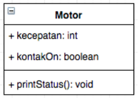

4. Kemudian buat class MotorDemo, ketikkan kode berikut ini.

    ```java
    package motorencapsulation;

    public class MotorDemo {
        public static void main(String[] args) {
            Motor motor = new Motor();
            motor.printStatus();
            motor.kecepatan = 50;
            motor.printStatus();
        }
    }
    ```

5. Hasilnya adalah sebagai berikut:

    **OUTPUT**

    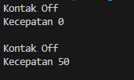

Dari percobaan 1 - enkapsulasi, menurut anda, adakah yang janggal?

Yaitu, kecepatan motor tiba-tiba saja berubah dari 0 ke 50. Lebih janggal lagi, posisi kontak motor masih dalam kondisi OFF. Bagaimana mungkin sebuah motor bisa sekejap berkecepatan dari nol ke 50, dan itupun kunci kontaknya OFF? 

Nah dalam hal ini, akses ke atribut motor ternyata tidak terkontrol. Padahal, objek di dunia nyata selalu memiliki batasan dan mekanisme bagaimana objek tersebut dapat digunakan. Lalu, bagaimana kita bisa memperbaiki class Motor diatas agar dapat digunakan dengan baik? Kita bisa pertimbangkan beberapa hal berikut ini:

1. Menyembunyikan atribut internal (kecepatan, kontakOn) dari pengguna (class lain)
2. Menyediakan method khusus untuk mengakses atribut. 

Untuk itu mari kita lanjutkan percobaan berikutknya tentang Access Modifier. 

## 3.2 Percobaan 2: Access Modifier
Pada percobaan ini akan digunakan access modifier untuk memperbaiki cara kerja class Motor pada 
percobaan ke-1.

1. Ubah cara kerja class motor sesuai dengan UML class diagram berikut.

    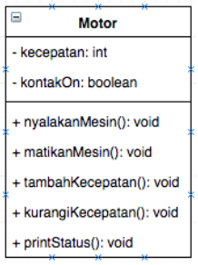

2. Berdasarkan UML class diagram tersebut maka class Motor terdapat perubahan, yaitu:

    a. Ubah access modifier kecepatan dan kontakOn menjadi private

    b. Tambahkan method nyalakanMesin, matikanMesin, tambahKecepatan, kurangiKecepatan.

    Implementasi class Motor adalah sebagai berikut:
    
    ```java
    package motorencapsulation;

    public class Motor {
        // akses modifier diubah private
        private int kecepatan = 0;
        private boolean kontakOn = false;

        // method yang ditambahkan
        public void nyalakanMesin() {
            kontakOn = true; 
        }
        public void matikanMesin() {
            kontakOn = false;
            kecepatan = 0;
        }
        public void tambahKecepatan() {
            if (kontakOn == true) {
                kecepatan += 5;
            }
            else {
                System.out.println("Kecepatan tidak bisa bertambah karena Mesin Off! \n");
            }
        }
        public void kurangiKecepatan() {
            if (kontakOn == true) {
                kecepatan -= 5;
            }
            else {
                System.out.println("Kecepatan tidak bisa berkurang karena Mesin Off! \n");
            }
        }

        public void printStatus() {
            if (kontakOn == true) {
                System.out.println("Kontak On");
            }
            else {
                System.out.println("Kontak Off");
            }
            System.out.println("Kecepatan " + kecepatan+"\n");
        }
    }
    ```

3. Kemudian pada class MotorDemo, ubah code menjadi seperti berikut:
    ```java
    package motorencapsulation;

    public class MotorDemo {
        public static void main(String[] args) {
            Motor motor = new Motor();
            motor.printStatus();
            motor.tambahKecepatan();

            motor.nyalakanMesin();
            motor.printStatus();

            motor.tambahKecepatan();
            motor.printStatus();

            motor.tambahKecepatan();
            motor.printStatus();

            motor.tambahKecepatan();
            motor.printStatus();

            motor.matikanMesin();
            motor.printStatus();
        }
    }
    ```
4. Hasilnya dari class MotorDemo adalah sebagai berikut:

    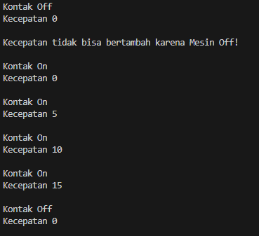

Dari percobaan diatas, dapat kita amati sekarang atribut kecepatan tidak bisa diakses oleh pengguna  dan diganti nilainya secara sembarangan. Bahkan ketika mencoba menambah kecepatan saat posisi kontak masih OFF, maka akan muncul notifikasi bahwa mesin OFF. Untuk mendapatkan kecepatan yang diinginkan, maka harus dilakukan secara gradual, yaitu dengan memanggil method tambahKecepatan() beberapa kali. Hal ini mirip seperti saat kita mengendarai motor. 

## 3.3 Pertanyaan

1. Pada class TestMobil, saat kita menambah kecepatan untuk pertama kalinya, mengapa muncul peringatan “Kecepatan tidak bisa bertambah karena Mesin Off!”?

    **Jawaban:**

    Hal ini dikarenakan mesin dalam kadaan off, sehingga kecepatan tidak bisa ditambahkan.

2. Mengapat atribut kecepatan dan kontakOn diset private? 

    **Jawaban:**

    Atribut kecepatan dan kontakOn diset private karena untuk mencegah akses dari luar, dan agar dalam pengambilan data tersebut harus perlu akses method yang ada didalam class tersebut tanpa menyentuh langsung atributnya.

3. Ubah class Motor sehingga kecepatan maksimalnya adalah 100!

    **Jawaban:**

    ```java
    package motorencapsulation;

    public class Motor {
        // akses modifier diubah private
        private int kecepatan = 0;
        private boolean kontakOn = false;
        private final int kecepatanMaksimal = 100;

        // method yang ditambahkan
        public void nyalakanMesin() {
            kontakOn = true; 
        }
        public void matikanMesin() {
            kontakOn = false;
            kecepatan = 0;
        }
        public void tambahKecepatan() {
            if (kontakOn) {
                if (kecepatan + 5 <= kecepatanMaksimal) {
                kecepatan += 5;
                } else {
                System.out.println("Kecepatan sudah mencapai batas maksimal! \n");
                }
            } else {
            System.out.println("Kecepatan tidak bisa bertambah karena Mesin Off! \n");
            }
        }
        public void kurangiKecepatan() {
            if (kontakOn) {
                if (kecepatan - 5 >= 0) {      
                kecepatan -= 5;
                } else {
                System.out.println("Kecepatan tidak bisa berkurang karena sudah 0! \n");
                }
            } else {
            System.out.println("Kecepatan tidak bisa berkurang karena Mesin Off! \n");
            }
        }

        public void printStatus() {
            if (kontakOn == true) {
            System.out.println("Kontak On");
            }
            else {
            System.out.println("Kontak Off");
            }
            System.out.println("Kecepatan " + kecepatan+"\n");
        }
    }
    ```

## 3.4 Percobaan 3: Getter dan Setter
Misalkan di sebuah sistem informasi koperasi, terdapat class Anggota
Anggota memiliki atribut nama, alamat dan simpanan, dan method setter, getter dan setor dan pinjam. Semua atribut pada anggota tidak boleh  diubahsembarangan, melainkan hanya dapat diubah melalui method setter, 
getter, setor dan tarik. Khusus untuk atribut simpanan tidak terdapat setter karena simpanan akan bertambah ketika melakukan transaksi setor dan akan berkurang ketika melakukan peminjaman/tarik.

1. Berikut ini UML class buatlah class Mahasiswa pada program:
    
    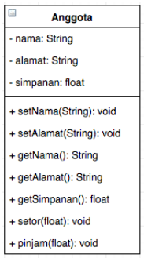

2. Sama dengan percobaan 1 untuk membuat project baru

    a. Buka Netbeans, buat project KoperasiGetterSetter.

    b. Buat class Anggota. Klik kanan pada package koperasigettersetter – New – Java Class.

    c. Ketikkan kode class Anggota dibawah ini.

    ```java
    package koperasigettersetter;

    public class Anggota {
        private String nama;
        private String alamat;
        private float simpanan;

        // setter, getter nama dan alamat
        public void setNama(String nama) {
            this.nama = nama;
        }
        public void setAlamat(String alamat) {
            this.alamat = alamat;
        }
        public String getNama() {
            return nama;
        }
        public String getAlamat() {
            return alamat;
        }

        //getter simpanan
        public float getSimpanan() {
            return simpanan;
        }
        public void setor(float uang) {
            simpanan += uang;
        }
        public void pinjam(float uang) {
            simpanan -= uang;
        }
    }
    ```

    Jika diperhatikan pada class Anggota, atribut nama dan alamat memili masing-masing 1 getter dan setter. Sedangkan atribut simpanan hanya memiliki getSimpanan() saja, karena seperti tujuan awal, atribut simpanan akan berubah nilainya jika melakukan transaksi setor() dan pinjam/tarik(). 

3. Selanjutnya buatlah class KoperasiDemo untuk mencoba class Anggota.

    ```java
    package koperasigettersetter;

    public class KoperasiDemo {
        public static void main(String[] args) {
            Anggota anggota1 = new Anggota();
                anggota1.setNama("Iwan Setiawan");
                anggota1.setAlamat("Jalan Sukarno Hatta no 10");
                anggota1.setor(100000);
                System.out.println("Simpanan " +anggota1.getNama()+ " : Rp "+ anggota1.getSimpanan());

                anggota1.pinjam(5000);
                System.out.println("Simpanan " +anggota1.getNama()+ " : Rp "+ anggota1.getSimpanan());
        }
    }
    ```

4. Hasil dari main method pada langkah ketiga adalah
    
    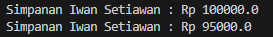

Dapat dilihat pada hasil percobaan diatas, untuk mengubah simpanan tidak dilakukan secara  langsung dengan mengubah atribut simpanan, melainkan melalui method setor() dan pinjam().Untuk menampilkan nama pun harus melalui method getNama(), dan untuk menampilkan simpanan melalui getSimpanan().

## 3.5 Percobaan 4: Konstruktor, Instansiasi
1. Langkah pertama percobaan 4 adalah ubah class KoperasiDemo seperti berikut
    
    ```java
    package koperasigettersetter;

    public class KoperasiDemo {
        public static void main(String[] args) {
            Anggota anggota1 = new Anggota();
            System.out.println("Simpanan " +anggota1.getNama()+ " : Rp "+ anggota1.getSimpanan());
                anggota1.setNama("Iwan Setiawan");
                anggota1.setAlamat("Jalan Sukarno Hatta no 10");
                anggota1.setor(100000);
                System.out.println("Simpanan " +anggota1.getNama()+ " : Rp "+ anggota1.getSimpanan());

                anggota1.pinjam(5000);
                System.out.println("Simpanan " +anggota1.getNama()+ " : Rp "+ anggota1.getSimpanan());
        }
    }
    ```

2. Hasil dari program tersebut adalah sebagai berikut

    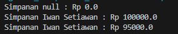

    Dapat dilihat hasil running program, ketika dilakukan pemanggilan method getNama() 
    hasilnya hal ini terjadi karena atribut nama belum diset nilai defaultnya. Hal ini dapat ditangani dengan membuat kontruktor.

3. Ubah class Anggota menjadi seperti berikut

    ```java
    package koperasigettersetter;

    public class Anggota {
        private String nama;
        private String alamat;
        private float simpanan;

        Anggota(String nama, String alamat) {
            this.nama = nama;
            this.alamat = alamat;
            this.simpanan = 0;
        }

        // setter, getter nama dan alamat
        public void setNama(String nama) {
            this.nama = nama;
        }
        public void setAlamat(String alamat) {
            this.alamat = alamat;
        }
        public String getNama() {
            return nama;
        }
        public String getAlamat() {
            return alamat;
        }

        //getter simpanan
        public float getSimpanan() {
            return simpanan;
        }
        public void setor(float uang) {
            simpanan += uang;
        }
        public void pinjam(float uang) {
            simpanan -= uang;
        }
    }
    ```

    Pada class Anggota dibuat kontruktor dengan access modifier default yang memiliki 2 parameter nama dan alamat. Dan didalam konstruktor tersebut dipastikan nilai simpanan untuk pertama kali adalah Rp. 0.

4. Selanjutnya ubah class KoperasiDemo sebagai berikut
    ```java
    package koperasigettersetter;

    public class KoperasiDemo {
        public static void main(String[] args) {
            Anggota anggota1 = new Anggota("Iwan","Jalan Mawar");
            System.out.println("Simpanan " +anggota1.getNama()+ " : Rp "+ anggota1.getSimpanan());
            
            anggota1.setNama("Iwan Setiawan");
                anggota1.setAlamat("Jalan Sukarno Hatta no 10");
                anggota1.setor(100000);
                System.out.println("Simpanan " +anggota1.getNama()+ " : Rp "+ anggota1.getSimpanan());

                anggota1.pinjam(5000);
                System.out.println("Simpanan " +anggota1.getNama()+ " : Rp "+ anggota1.getSimpanan());
        }
    }
    ```

5. Hasil dari program tersebut adalah sebagai berikut

    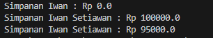

    Setelah menambah konstruktor pada class Anggoata maka atribut nama dan alamat secara otomatis harus diset terlebih dahulu dengan melakukan passing parameter jika melakukan instansiasi class Anggota. Hal ini biasa dilakukan untuk atribut yang membutuhkan nilai yang spesifik. Jika tidak membutuhkan nilai spesifik dalam konstruktor tidak perlu parameter. Contohnya simpanan untuk anggota baru diset 0, maka simpanan tidak perlu untuk dijadikan parameter pada konstruktor.

## 3.6 Pertanyaan - Percobaan 3 dan 4
1. Apa yang dimaksud getter dan setter?

    **Jawaban:**

    Getter adalah public method dan memiliki tipe data return, yang berfungsi untuk mendapatkan nilai dari atribut private. Sedangkan setter adalah public method yang tidak memliki tipe data return, yang berfungsi untuk memanipulasi nilai dari atribut private.

2. Apa kegunaan dari method getSimpanan()?

    **Jaewaban:**

    Method getSimpan() digunakan untuk mengambil atau mendapatkan nilai dari suatu atribut atau data yang bersifat "simpanan" atau "penyimpanan" dalam sebuah objek atau kelas. Method ini dapat digunakan untuk mengakses atau membaca data tertentu yang mungkin telah disimpan atau dihitung sebelumnya dalam objek tersebut.

3. Method apa yang digunakan untk menambah saldo?

    **Jawaban:**

    Method yang digunakan untuk menambah saldo adalah method setor atau setor(float uang).

4. Apa yand dimaksud konstruktor?

    **Jawaban:**

    Konstruktor adalah sebuah metode khusus dalam bahasa pemrograman yang digunakan untuk menginisialisasi atau membuat objek dari suatu kelas Konstruktor mirip dengan method cara deklarasinya akan tetapi tidak memiliki tipe return. Dan konstruktor dieksekusi ketika instan dari objek dibuat. Jadi setiap kali sebuat objek dibuat dengan keyword new() maka konstruktor akan dieksekusi.

5. Sebutkan aturan dalam membuat konstruktor?

    **Jawaban:**

    Cara untuk membuat konstruktor adalah sebagai berikut: 
    1. Nama konstruktor harus sama dengan nama class.
    2. Konstruktor tidak memiliki tipe data return.
    3. Konstruktor tidak boleh menggunakan modifier abstract, static, final, dan synchronized.

6. Apakah boleh konstruktor bertipe private?

    **Jawaban:**

    Ya boleh, Ketika suatu konstruktor memiliki aksesibilitas private, itu berarti konstruktor tersebut hanya dapat diakses atau dipanggil dari dalam kelas itu sendiri. Hal ini mengakibatkan objek dari kelas tersebut tidak dapat dibuat secara konvensional di luar kelas.

7. Kapan menggunakan parameter dengan passsing parameter?

    **Jawaban:**

    Passing parameter digunakan ketika tidak perlu method getter dan setter. 

8. Apa perbedaan atribut class dan instansiasi atribut?

    **Jawaban:**

    - Atribut kelas adalah atribut yang terkait dengan seluruh kelas, bukan dengan instansi kelas tertentu. Sedangkan Atribut instansiasi adalah atribut yang terkait dengan objek (instansi) tertentu dari kelas.
    - Nilai atribut kelas bersifat global untuk seluruh objek kelas, artinya jika Anda mengubah nilai atribut kelas dari satu objek, perubahan tersebut akan tercermin pada semua objek dari kelas yang sama. Sedangkan atribut sinstansiasi tidak bersifat bersama dan nilainya dapat berbeda antara satu objek dengan objek lainnya.
    - Atribut kelas digunakan untuk menyimpan data yang bersama untuk seluruh kelas, sedangkan atribut instansiasi digunakan untuk menyimpan data yang unik per objek dalam kelas tersebut.


9. Apa perbedaan class method dan instansiasi method?

    **Jawaban:**

    Class method berkaitan dengan class itu sendiri dan tidak memiliki akses langsung ke variabel atau metode objek. Sedangkan instansi method merupakan method yang digunakan di dalam class lain dan dapat mengakses dan memanipulasi variabel dan metode objek.

# 4. Kesimpulan
Dari percobaan diatas, telah dipelajari kosep dari enkapsulasi, kontruktor, access modifier yang terdiri dari 4 jenis yaitu public, protected, default dan private. Konsep atribut atau method class yang ada di dalam blok code class dan konsep instansiasi atribut atau method. Cara penggunaan getter dan setter beserta fungsi dari getter dan setter. Dan juga telah dipelajari atau memahami notasi UML.

# 5. Tugas
1. Cobalah program dibawah ini dan tuliskan hasil outputnya

    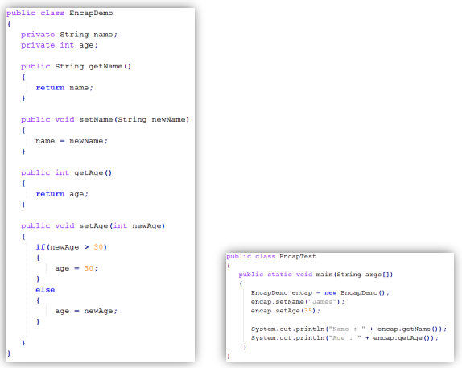

    **Jawaban:**

    ```java
    public class EncapDemo {
        private String name;
        private int age;

        public String getName() {
            return name;
        }

        public void setName(String newName) {
            name = newName;
        }

        public int getAge() {
            return age;
        }

        public void setAge(int newAge) {
            if(newAge > 30) {
                age = 30;
            } else {
                age = newAge;
            }
        }
    }
    ```

    ```java
    public class EncapTest {
        public static void main(String[] args) {
            EncapDemo encap = new EncapDemo();
            encap.setName("James");
            encap.setAge(35);

            System.out.println("Name : " + encap.getName());
            System.out.println("Age : " + encap.getAge());
        }
    }
    ```

    **OUTPUT**
    
    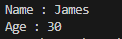

2. Pada program diatas, pada class EncapTest kita mengeset age dengan nilai 35, namun pada saat ditampilkan ke layar nilainya 30, jelaskan mengapa.

    **Jawaban:**

    Output yang dikeluarkan bernilai 30 karena pada pengondisian method setAge, jika age yang dimasukkan lebih dari 30 maka output yang keluar akan bernilai 30.

3. Ubah program diatas agar atribut age dapat diberi nilai maksimal 30 dan minimal 18.

    **Jawaban:**

    Kode Program yang diubah pada class EncapDemo

    ```java
    public void setAge(int newAge) {
        if(newAge > 30) {
            System.out.println("Input maksimal 30");
        } else if (newAge < 18) {
            System.out.println("Input minimal 18");
        } else {
            this.age = age;
        }
    }
    ```

    Class EncapTest jika setAge yang diinputkan kurang dari 18

    ```java
    public class EncapTest {
        public static void main(String[] args) {
            EncapDemo encap = new EncapDemo();
            encap.setName("James");
            encap.setAge(15);

            System.out.println("Name : " + encap.getName());
            System.out.println("Age : " + encap.getAge());
        }
    }
    ```

    **OUTPUT**

    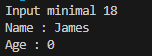

    Class EncapTest jika setAge yang diinputkan lebih dari 35

    ```java
    public class EncapTest {
        public static void main(String[] args) {
            EncapDemo encap = new EncapDemo();
            encap.setName("James");
            encap.setAge(35);

            System.out.println("Name : " + encap.getName());
            System.out.println("Age : " + encap.getAge());
        }
    }
    ```

    **OUTPUT**

    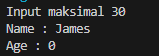

4. Pada sebuah sistem informasi koperasi simpan pinjam, terdapat class Anggota yang memiliki atribut antara lain nomor KTP, nama, limit peminjaman, dan jumlah pinjaman. Anggota dapat meminjam uang dengan batas limit peminjaman yang ditentukan. Anggota juga dapat mengangsur pinjaman. Ketika Anggota tersebut mengangsur pinjaman, maka jumlah pinjaman akan berkurang sesuai dengan nominal yang diangsur. Buatlah class Anggota tersebut, berikan atribut, method dan konstruktor sesuai dengan kebutuhan. Uji dengan TestKoperasi berikut ini untuk memeriksa apakah class Anggota yang anda buat telah sesuai dengan yang diharapkan.

    **Jawaban:**

    ```java
    package Tugas4;

    public class Anggota {
        private String noKtp;
        private String nama;
        private int limitPeminjaman;
        private int jumlahPinjaman;
        private int angsur;

        public Anggota(String noKtp, String nama, int limitPeminjaman) {
            this.noKtp = noKtp;
            this.nama = nama;
            this.limitPeminjaman = limitPeminjaman;
        }
        public String getNama() {
            return nama;
        }
        public void setNama(String nama) {
            this.nama = nama;
        }
        public int getLimitPinjaman() {
            return limitPeminjaman;
        }
        public void setLimitPinjaman(int limitPeminjaman) {
            this.limitPeminjaman = limitPeminjaman;
        }   
        public int getJumlahPeminjaman() {
            return jumlahPinjaman;
        }
        public void pinjam(int jumlahPinjaman) {
            if(jumlahPinjaman > this.limitPeminjaman) {
                System.out.println("Maaf, Jumlah peminjaman melebihi limit");
            } else {
                this.jumlahPinjaman = jumlahPinjaman;
            } 
        }
        public void angsur(int angsur) {
            this.jumlahPinjaman = this.jumlahPinjaman - angsur;
        }
    }
    ```

    ```java
    package Tugas4;

    public class TestKoperasi {
        public static void main(String[] args) {
            Anggota donny = new Anggota("111333444","Donny", 5000000);
            System.out.println("Nama Anggota\t: " + donny.getNama());
            System.out.println("Limit Pinjaman\t: " + donny.getLimitPinjaman());
            System.out.println("\nMeminjam uang 10.000.000...");
            donny.pinjam(10000000);
            System.out.println("\nMeminjam uang 4.000.000...");
            donny.pinjam(4000000);
            System.out.println("Jumlah pinjaman saat ini : " + donny.getJumlahPeminjaman());
            System.out.println("\nMembayar angsuran 1.000.000");
            donny.angsur(1000000);
            System.out.println("Jumlah pinjaman saat ini : " + donny.getJumlahPeminjaman());
            System.out.println("\nMembayar angsuran 3.000.000");
            donny.angsur(3000000);
            System.out.println("Jumlah pinjaman saat ini : " + donny.getJumlahPeminjaman());
        }
    }
    ```

    **OUTPUT**

    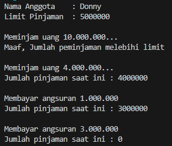

5. Modifikasi soal no. 4 agar nominal yang dapat diangsur minimal adalah 10% dari jumlah pinjaman saat ini. Jika mengangsur kurang dari itu, maka muncul peringatan “Maaf, angsuran harus 10% dari jumlah pinjaman”.

    **Jawaban:**

    ```java
    package Tugas4;

    public class Anggota {
        private String noKtp;
        private String nama;
        private int limitPeminjaman;
        private int jumlahPinjaman;
        private int angsur;

        public Anggota(String noKtp, String nama, int limitPeminjaman) {
            this.noKtp = noKtp;
            this.nama = nama;
            this.limitPeminjaman = limitPeminjaman;
        }
        public String getNama() {
            return nama;
        }
        public void setNama(String nama) {
            this.nama = nama;
        }
        public int getLimitPinjaman() {
            return limitPeminjaman;
        }
        ublic void setLimitPinjaman(int limitPeminjaman) {
            this.limitPeminjaman = limitPeminjaman;
        }
        public int getJumlahPeminjaman() {
            return jumlahPinjaman;
        }
        public void pinjam(int jumlahPinjaman) {
            if(jumlahPinjaman > this.limitPeminjaman) {
            System.out.println("Maaf, Jumlah peminjaman melebihi limit");
            } else {
            this.jumlahPinjaman = jumlahPinjaman;
            } 
        }
        public void angsur(int angsur) {
            int minimAngsur = (10 * this.jumlahPinjaman) / 100;
            if(angsur < minimAngsur) {
                System.out.println("Maaf, angsuran harus 10% dari jumlah pinjaman");
            } else {
                this.jumlahPinjaman = this.jumlahPinjaman - angsur;
            }
        }
    }
    ```

    ```java
    package Tugas4;

    public class TestKoperasi {
        public static void main(String[] args) {
            Anggota donny = new Anggota("111333444","Donny", 5000000);
            System.out.println("Nama Anggota\t: " + donny.getNama());
            System.out.println("Limit Pinjaman\t: " + donny.getLimitPinjaman());
            System.out.println("\nMeminjam uang 10.000.000...");
            donny.pinjam(10000000);
            System.out.println("\nMeminjam uang 4.000.000...");
            donny.pinjam(4000000);
            System.out.println("Jumlah pinjaman saat ini : " + donny.getJumlahPeminjaman());
            System.out.println("\nMembayar angsuran 200.000");
            donny.angsur(200000);
            System.out.println("Jumlah pinjaman saat ini : " + donny.getJumlahPeminjaman());
            System.out.println("\nMembayar angsuran 3.000.000");
            donny.angsur(3000000);
            System.out.println("Jumlah pinjaman saat ini : " + donny.getJumlahPeminjaman());
        }
    }
    ```

    **OUTPUT**

    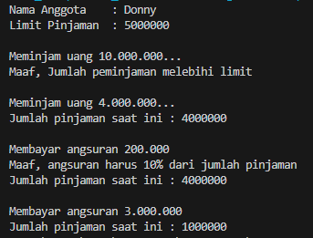

6. Modifikasi class TestKoperasi, agar jumlah pinjaman dan angsuran dapat menerima input dari console.

    **Jawaban:**

    ```java
    package Tugas4;
    import java.util.Scanner;
    public class TestKoperasi {
        public static void main(String[] args) {
            Scanner input = new Scanner(System.in);

            Anggota donny = new Anggota("111333444","Donny", 5000000);
            System.out.println("Nama Anggota\t: " + donny.getNama());
            System.out.println("Limit Pinjaman\t: " + donny.getLimitPinjaman());
            System.out.println("------------------------------------------");
            //System.out.println("\nMeminjam uang 10.000.000...");
            //donny.pinjam(10000000);

            int pinjam;
            System.out.print("Masukkan peminjaman\t\t: ");
            pinjam = input.nextInt();
            donny.pinjam(pinjam);
            System.out.println("Jumlah pinjaman saat ini\t: " + donny.getJumlahPeminjaman());

            //System.out.println("\nMeminjam uang 4.000.000...");
            //donny.pinjam(4000000);
            //System.out.println("Jumlah pinjaman saat ini : " + donny.getJumlahPeminjaman());
            //System.out.println("\nMembayar angsuran 1.000.000");
            //donny.angsur(1000000);

            int angsur;
            System.out.print("\nMasukkan angsuran\t\t: ");
            angsur = input.nextInt();
            donny.angsur(angsur);
            System.out.println("Jumlah pinjaman saat ini\t: " + donny.getJumlahPeminjaman());
        
            //System.out.println("\nMembayar angsuran 3.000.000");
            //donny.angsur(3000000);
            //System.out.println("Jumlah pinjaman saat ini : " + donny.getJumlahPeminjaman());
    
            input.close();
        }
    }
    ```

    **OUTPUT**

    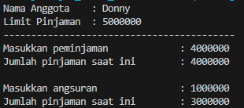

    