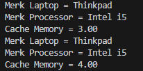

# Laporan Praktikum Pertemuan 4

# Jobsheet 4: Relasi Kelas

## Data Mahasiswa
Nama    : Chamillatul Luqiana Agustin

Nim     : 2241720020

Kelas   : TI-2C

# III. Praktikum

# Percobaan 1
a. Perhatikan diagram class berikut:


b. Buka project baru di Netbeans dan buat package dengan format berikut:


Catatan: Penamaan package dengan tambahan identifier untuk menghindari adanya 
kemungkinan penamaan class yang bentrok.

c. Buatlah class Processor dalam package tersebut.
```java
package Percobaan1;

public class Processor {
    
}
```

d. Tambahkan atribut merk dan cache pada class Processor dengan akses modifier private.
```java
private String merk;
private double cache;
```

e. Buatlah constructor default untuk class Processor.
```java
//Constructor default
public Processor() {

}
```

f. Buatlah constructor untuk class Processor dengan parameter merk dan cache.
```java
//Constructor dengan parameter merk dan cache
public Processor(String merk, double cache) {
    this.merk = merk;
    this.cache = cache;
}
```

g. Implementasikan setter dan getter untuk class Processor.
```java
//Setter atribut merk
public void setMerk(String merk) {
    this.merk = merk;
}

//Getter atribut merk
public String getMerk() {
    return merk;
}

//Setter atribut cache
public void setCache(double cache) {
    this.cache = cache;
}

//Getter atribut cache
public double getCache() {
    return cache;
}
```

h. Implementasikan method info() seperti berikut:
```java
//Method info()
public void info() {
    System.out.printf("Merk Processor = %s\n", merk);
    System.out.printf("Cache Memory = %.2f\n", cache);
}
```

i. Kemudian buatlah class Laptop di dalam package yang telah anda buat.
```java
package Percobaan1;

public class Laptop {

}
```

j. Tambahkan atribut merk dengan tipe String dan proc dengan tipe Object Processor
```java
private String merk;
private Processor proc;
```

k. Buatlah constructor default untuk class Laptop.
```java
//Constructor default
public Laptop() {

}
```

l. Buatlah constructor untuk class Laptop dengan parameter merk dan proc.
```java
//Constructor dengan parameter merk dan proc
public Laptop(String merk, Processor proc) {
    this.merk = merk;
    this.proc = proc;
}

//Setter atribut merk
public void setMerk(String merk) {
    this.merk = merk;
}

//Getter atribut merk
public String getMerk() {
    return merk;
}

//Setter untuk atribut proc
public void setProc(Processor proc) {
    this.proc = proc;
}

//Getter untuk atribut proc
public Processor getProc()  {
    return proc;
}
```

m. Selanjutnya implementasikan method info() pada class Laptop sebagai berikut
```java
//Method info()
public void info() {
    System.out.println("Merk Laptop = " + merk);
    proc.info();
}
```

n. Pada package yang sama, buatlah class MainPercobaan1 yang berisi method main().
```java
package Percobaan1;

public class MainPercobaan1 {
    public static void main(String[] args) {
        
    }
}
```

o. Deklarasikan Object Processor dengan nama p kemudian instansiasi dengan informasi atribut Intel i5 untuk nilai merk serta 3 untuk nilai cache.
```java
//Deklarasi dan instansiasi objek processor
Processor p = new Processor("Intel i5", 3);
```

p. Kemudian deklarasikan serta instansiasi Objek Laptop dengan nama L dengan informasi atribut Thinkpad dan Objek Processor yang telah dibuat.
```java
//Deklarasi dan instansiasi objek Laptop dengan Processor
    Laptop L = new Laptop("Thinkpad", p);
```

q. Panggil method info() dari Objek L.
```java
//Panggil method info() daro objek L
    L.info();
```

r. Tambahkan baris kode berikut
```java
Processor p1 = new Processor();
p1.setMerk("Intel i5");
p1.setCache(4);
Laptop L1 = new Laptop();
L1.setMerk("Thinkpad");
L1.setProc(p1);
L1.info();
```

s. Compile kemudian run class MainPercobaan1, akan didapatkan hasil seperti berikut:

### OUTPUT



### KODE PROGRAM

### Class Processor
```java
package Percobaan1;

public class Processor {
    //Atribut private
    private String merk;
    private double cache;

    //Constructor default
    public Processor() {

    }

    //Constructor dengan parameter merk dan cache
    public Processor(String merk, double cache) {
        this.merk = merk;
        this.cache = cache;
    }

    //Setter atribut merk
    public void setMerk(String merk) {
        this.merk = merk;
    }

    //Getter atribut merk
    public String getMerk() {
        return merk;
    }

    //Setter atribut cache
    public void setCache(double cache) {
        this.cache = cache;
    }

    //Getter atribut cache
    public double getCache() {
        return cache;
    }

    //Method info()
    public void info() {
        System.out.printf("Merk Processor = %s\n", merk);
        System.out.printf("Cache Memory = %.2f\n", cache);
    }
}
```

### Class Laptop
```java
package Percobaan1;

public class Laptop {
    //Atribut private
    private String merk;
    private Processor proc;

    //Constructor default
    public Laptop() {

    }

    //Constructor dengan parameter merk dan proc
    public Laptop(String merk, Processor proc) {
        this.merk = merk;
        this.proc = proc;
    }

    //Setter atribut merk
    public void setMerk(String merk) {
        this.merk = merk;
    }

    //Getter atribut merk
    public String getMerk() {
        return merk;
    }

    //Setter untuk atribut proc
    public void setProc(Processor proc) {
        this.proc = proc;
    }

    //Getter untuk atribut proc
    public Processor getProc()  {
        return proc;
    }

    //Method info()
    public void info() {
        System.out.println("Merk Laptop = " + merk);
        proc.info();
    }
}
```

### Class MainPercobaan1
```java
package Percobaan1;

public class MainPercobaan1 {
    public static void main(String[] args) {
        //Deklarasi dan instansiasi objek processor
        Processor p = new Processor("Intel i5", 3);

        //Deklarasi dan instansiasi objek Laptop dengan Processor
        Laptop L = new Laptop("Thinkpad", p);

        //Panggil method info() daro objek L
        L.info();

        //Membuat objek Processor p1 dan objek Laptop L1
        Processor p1 = new Processor();
        p1.setMerk("Intel i5");
        p1.setCache(4);
        Laptop L1 = new Laptop();
        L1.setMerk("Thinkpad");
        L1.setProc(p1);
        L1.info();
    }
}
```

## Pertanyaan
1. Di dalam class Processor dan class Laptop , terdapat method setter dan getter untuk masing‑masing atributnya. Apakah gunanya method setter dan getter tersebut ?

    **Jawaban:**
    - Method setter untuk mengubah nilai atribut-atriubt dalam objek Processor dan Laptop, sedangkan method getter untuk mendapatkan nilai-nilai tersebut. 
    - Penggunaan setter dan getter ini membantu dalam prinsip enkapsulasi, yang memungkinkan Anda untuk mengendalikan bagaimana nilai-nilai atribut diatur dan diakses, dan ini merupakan salah satu praktik dasar dalam pemrograman berorientasi objek.
    

2. Di dalam class Processor dan class Laptop masing‑masing terdapat konstruktor default dan konstruktor berparameter. Bagaimanakah beda penggunaan dari kedua jenis konstruktor tersebut ?

    **Jawaban:**
    - Konstruktor default adalah konstruktor yang tidak memiliki parameter. Konstruktor default digunakan ketika ingin membuat objek tanpa harus memberikan nilai awal pada atribut-atributnya. Hal ini berguna jika ingin memberikan nilai atribut secara terpisah menggunakan setter.
    - Konstruktor berparameter adalah konstruktor yang menerima satu atau lebih parameter untuk menginisialisasi atribut-atribut objek. Konstruktor berparameter digunakan untuk menginisialisasi objek dengan nilai nilai tertentu di parameter.

3. Perhatikan class Laptop, di antara 2 atribut yang dimiliki (merk dan proc), atribut manakah yang bertipe object ?

    **Jawaban**

    Dalam class Laptop, atribut yang bertipe object adalah atribut proc. Hal ini dikarenakan inisasi tipe variabel ditandai dengan nama object, yaitu atribut 'proc' bertipe objek dari class Processor. Atribut proc digunakan untuk menyimpan referensi ke objek Processor yang mengandung informasi tentang prosesor laptop.

4. Perhatikan class Laptop, pada baris manakah yang menunjukan bahwa class Laptop memiliki relasi dengan class Processor ?

    **Jawaban:**

    Relasi antara class Laptop dan class Processor terjadi pada baris berikut:
    ```java
    private Processor proc;
    ```

    Pada baris ini mendeklarasikan sebuah atribut dengan nama proc dalam class Laptop yang memiliki tipe data Processor. Dengan deklarasi ini, class Laptop memiliki relasi dengan class Processor, dan objek dari class Processor dapat diakses melalui atribut proc dalam class Laptop.

5. Perhatikan pada class Laptop , Apakah guna dari sintaks proc.info() ?

    **Jawaban:**

    Sintaks proc.info() dalam class Laptop memiliki digunakan untuk memanggil method info() dari objek proc, yang merupakan objek dari class Processor. Dengan melakukan ini, dapat menggabungkan informasi tentang laptop yang terdapat dalam class Laptop dengan informasi tentang prosesor yang terdapat dalam class Processor. Sehingga saat memanggil info() pada objek Laptop, maka akan memanggil info() pada objek proc (class Processor) dan menampilkan informasi dari keduanya secara bersamaan. 

6. Pada class MainPercobaan1, terdapat baris kode:
    ```java
    Laptop L = new Laptop("Thinkpad", p);
    ```
    Apakah p tersebut ?

    Dan apakah yang terjadi jika baris kode tersebut diubah menjadi:
    ```java
    Laptop L = new Laptop("Thinkpad", new Processor("Intel i5", 3));
    ```
    Bagaimanakah hasil program saat dijalankan, apakah ada perubahan ?

    **Jawaban**
    - p pada kode Laptop L = new Laptop("Thinkpad", p); merupakan object dari class Processor yang tadi telah diinstasiasi.
    - Hasil yang terjadi jika baris kode tersebut diubah menjadi Laptop L = new Laptop("Thinkpad", new Processor("Intel i5", 3));Maka output yang dihasilkan sama saja, kerena p merupakan object dari class Processor yang memiliki atribut ‘Model’ dan ‘cache’ yang bernilai 3.

        

# percobaan 2
Perhatikan diagram class berikut yang menggambarkan sistem rental mobil. Pelanggan bisa menyewa mobil sekaligus sopir. Biaya sopir dan biaya sewa mobil dihitung per hari.


a. Tambahkan package

b. Buatlah class Mobil di dalam package tersebut.
```java
package Percobaan2;

public class Mobil {
    
}
```

c. Tambahkan atribut merk tipe String dan biaya tipe int dengan akses modifier private.
```java
private String nama;
private int biaya;
```

d. Tambahkan constructor default serta setter dan getter.
```java
//Constructor default
public Mobil() {

}

//Setter atribut nama
public void setNama(String nama) {
    this.nama = nama;
}

//Getter atribut nama
public String getNama() {
    return nama;
}

//Setter atribut biaya
public void setBiaya(int biaya) {
    this.biaya = biaya;
}

//Getter atribut biaya
public int getBiaya() {
    return biaya;
}
```

e. Implementasikan method hitungBiayaMobil
```java
//Method hitungBiayaMobil
public int hitungBiayaMobil(int hari) {
    return biaya * hari;
}
```

f. Tambahkan class Sopir dengan atribut nama tipe String dan biaya tipe int dengan akses modifier private berikut dengan constructor default.
```java
package Percobaan2;

public class Sopir {
    //Atribut private
    private String nama;
    private int biaya;

    //Constructor default
    public Sopir() {

    }

    //Setter atribut nama
    public void setNama(String nama) {
        this.nama = nama;
    }

    //Getter atribut nama
    public String getNama() {
        return nama;
    }

    //Setter atribut biaya
    public void setBiaya(int biaya) {
        this.biaya = biaya;
    }

    //Getter atribut biaya
    public int getBiaya() {
        return biaya;
    }
}
```

g. Implementasikan method hitungBiayaSopir
```java
//Method hitungBiayaSopir
public int hitungBiayaSopir(int hari) {
    return biaya * hari;
}
```

h. Tambahkan class Pelanggan dengan constructor default.
```java
package Percobaan2;

public class Pelanggan {
    //Constructor default
    public Pelanggan() {

    }
}
```

i. Tambahkan atribut‑atribut dengan akses modifier private berikut:


```java
private String nama;
private Mobil mobil;
private Sopir sopir;
private int hari;
```

j. Implementasikan setter dan getter.
```java
//Setter atribut nama
public void setNama(String nama) {
    this.nama = nama;
}

//Getter atribut nama
public String getNama() {
    return nama;
}

//Setter atribut mobil
public void setMobil(Mobil mobil) {
    this.mobil = mobil;
}

//Getter atribut mobil
public Mobil getMobil() {
    return mobil;
}

//Setter atribut sopir
public void setSopir(Sopir sopir) {
    this.sopir = sopir;
}

//Getter atribut sopir
public Sopir getSopir() {
    return sopir;
}

//Setter atribut hari
public void setHari(int hari) {
    this.hari = hari;
}

//Getter atribut hari
public int getHari() {
    return hari;
}
```

k. Tambahkan method hitungBiayaTotal
```java
//Method hitungBiayaTotal
public int hitungBiayaTotal() {
    return mobil.hitungBiayaMobil(hari) + sopir.hitungBiayaSopir(hari);
}
```

l. Buatlah class MainPercobaan2 yang berisi method main(). Tambahkan baris kode berikut:
```java
package Percobaan2;

public class MainPercobaan2 {
    public static void main(String[] args) {
        //Membuat objek Mobil m dan menginisialisasi atributnya
        Mobil m = new Mobil();
        m.setNama("Avanza");
        m.setBiaya(350000);

        //Membuat objek Sopir s dan menginisialisasi atributnya
        Sopir s = new Sopir();
        s.setNama("John Doe");
        s.setBiaya(200000);

        //Membuat objek Pelanggan p dan menginisialisasi atributnya
        Pelanggan p = new Pelanggan();
        p.setNama("Jane Doe");
        p.setMobil(m);
        p.setSopir(s);
        p.setHari(2);

        //Menghitung dan mencetak biaya total
        System.out.println("Biaya Total = " + p.hitungBiayaTotal());
    }
}
```

m. Compile dan jalankan class MainPercobaan2, dan perhatikan hasilnya!

### OUTPUT


### KODE PROGRAM

### Class Mobil
```java
package Percobaan2;

public class Mobil {
    //Atribut private
    private String nama;
    private int biaya;

    //Constructor default
    public Mobil() {

    }

    //Setter atribut nama
    public void setNama(String nama) {
        this.nama = nama;
    }

    //Getter atribut nama
    public String getNama() {
        return nama;
    }

    //Setter atribut biaya
    public void setBiaya(int biaya) {
        this.biaya = biaya;
    }

    //Getter atribut biaya
    public int getBiaya() {
        return biaya;
    }

    //Method hitungBiayaMobil
    public int hitungBiayaMobil(int hari) {
        return biaya * hari;
    }
}
```

### Class Sopir
```java
package Percobaan2;

public class Sopir {
    //Atribut private
    private String nama;
    private int biaya;

    //Constructor default
    public Sopir() {

    }

    //Setter atribut nama
    public void setNama(String nama) {
        this.nama = nama;
    }

    //Getter atribut nama
    public String getNama() {
        return nama;
    }

    //Setter atribut biaya
    public void setBiaya(int biaya) {
        this.biaya = biaya;
    }

    //Getter atribut biaya
    public int getBiaya() {
        return biaya;
    }

    //Method hitungBiayaSopir
    public int hitungBiayaSopir(int hari) {
        return biaya * hari;
    }
}
```

### Class Pelanggan
```java
package Percobaan2;

public class Pelanggan {
    //Atribut private
    private String nama;
    private Mobil mobil;
    private Sopir sopir;
    private int hari;

    //Constructor default
    public Pelanggan() {

    }

    //Setter atribut nama
    public void setNama(String nama) {
        this.nama = nama;
    }

    //Getter atribut nama
    public String getNama() {
        return nama;
    }

    //Setter atribut mobil
    public void setMobil(Mobil mobil) {
        this.mobil = mobil;
    }

    //Getter atribut mobil
    public Mobil getMobil() {
        return mobil;
    }

    //Setter atribut sopir
    public void setSopir(Sopir sopir) {
        this.sopir = sopir;
    }

    //Getter atribut sopir
    public Sopir getSopir() {
        return sopir;
    }

    //Setter atribut hari
    public void setHari(int hari) {
        this.hari = hari;
    }

    //Getter atribut hari
    public int getHari() {
        return hari;
    }

    //Method hitungBiayaTotal
    public int hitungBiayaTotal() {
        return mobil.hitungBiayaMobil(hari) + sopir.hitungBiayaSopir(hari);
    }
}
```

### Class MainPercobaan2
```java
package Percobaan2;

public class MainPercobaan2 {
    public static void main(String[] args) {
        //Membuat objek Mobil m dan menginisialisasi atributnya
        Mobil m = new Mobil();
        m.setNama("Avanza");
        m.setBiaya(350000);

        //Membuat objek Sopir s dan menginisialisasi atributnya
        Sopir s = new Sopir();
        s.setNama("John Doe");
        s.setBiaya(200000);

        //Membuat objek Pelanggan p dan menginisialisasi atributnya
        Pelanggan p = new Pelanggan();
        p.setNama("Jane Doe");
        p.setMobil(m);
        p.setSopir(s);
        p.setHari(2);

        //Menghitung dan mencetak biaya total
        System.out.println("Biaya Total = " + p.hitungBiayaTotal());
    }
}
```

## Pertanyaan
1. Perhatikan class Pelanggan. Pada baris program manakah yang menunjukan bahwa class Pelanggan memiliki relasi dengan class Mobil dan class Sopir ?

    **Jawaban:**

    ```java
    private Mobil mobil;
    private Sopir sopir;
    ```
    Pada kedua baris tersebut, class Pelanggan memiliki atribut dengan tipe Mobil dan Sopir. Hal inilah yang menunjukkan bahwa class Pelanggan memiliki relasi dengan class Mobil dan class Sopir. Dengan memiliki atribut tersebut, class Pelanggan dapat berinteraksi dengan objek dari class Mobil dan class Sopir untuk menghitung biaya total.

2. Perhatikan method hitungBiayaSopir pada class Sopir, serta method hitungBiayaMobil pada class Mobil. Mengapa menurut Anda method tersebut harus memiliki argument hari ?

    **Jawaban:**

    Kedua method tersebut harus memiliki argument hari karena digunakan untuk menghitung biaya berdasarkan jumlah hari sewa. Dengan menggunakan argument hari, kita dapat mengkalkulasikan biaya berdasarkan berapa lama kendaraan (mobil atau sopir) akan disewa oleh pelanggan.

3. Perhatikan kode dari class Pelanggan. Untuk apakah perintah mobil.hitungBiayaMobil(hari) dan sopir.hitungBiayaSop (hari) ?

    **Jawaban:**

    Kode program tersebut digunakan untuk memanggil method hitungBiayaMobil pada class Mobil dan hitungBiayaSopir pada class Sopir, yang nantinya program tersebut akan menghitung total biaya sewa dengan menjumlahkan biaya mobil dikali hari dan biaya sopir dikali hari.

4. Perhatikan class MainPercobaan2. Untuk apakah sintaks p.setMobil(m) dan p.setSopir(s) ?

    **Jawaban:**

    Sintaks tersebut untuk mengatur atau menginisialisasi atribut mobil dan sopir pada objek p (objek Pelanggan) dengan objek m (objek Mobil) dan objek s (objek Sopir) dan sintaks tersebut digunakan untuk memberikan atau mengisi nilai dari variabel mobil dan sopir pada class Pelanggan.

5. Perhatikan class MainPercobaan2. Untuk apakah proses p.hitungBiayaTotal() tersebut ?

    **Jawaban:**

    Proses tersebut digunakan untuk menghitung biaya total sewa yang harus dibayar oleh pelanggan. Biaya total ini dihitung dengan menggabungkan biaya sewa mobil (m) dan biaya sewa sopir (s) yang telah diatur sebelumnya pada objek p (objek Pelanggan).

6. Perhatikan class MainPercobaan2, coba tambahkan pada baris terakhir dari method main dan amati perubahan saat di‑run!
    ```java
    System.out.println(p.getMobil().getNama());
    ```
    Jadi untuk apakah sintaks p.getMobil().getMerk() yang ada di dalam method main tersebut?

    **Jawaban:**

    Kode program tersebut menghasilkan output seperti ini:
    
    

    Jadi kedua sintaks tersebut berguna untuk mengakses merk dari object mobil yang dimiliki oleh object ps. Sehingga menampilkan merek mobil yang disewa.

# Percobaan 3
Pada percobaan‑percobaan sebelumnya, relasi dalam class dinyatakan dalam one‑to‑one. Tetapi ada kalanya relasi class melibatkan lebih dari satu. Hal ini disebut dengan multiplicity. Untuk relasi 
lebih rinci mengenai multiplicity, dapat dilihat pada tabel berikut.


a. Sebuah Kereta Api dioperasikan oleh Masinis serta seorang Asisten Masinis. Baik Masinis maupun Asisten Masinis keduanya merupakan Pegawai PT. Kereta Api Indonesia. Dari ilustrasi cerita tersebut, dapat digambarkan dalam diagram kelas sebagai berikut:


b. Perhatikan dan pahami diagram kelas tersebut, kemudian bukalah IDE anda!

c. Buatlah package, kemudian tambahkan class Pegawai.
```java
package Percobaan3;

public class Pegawai {
    
}
```

d. Tambahkan atribut‑atribut ke dalam class Pegawai private String nip; private String nama;
```java
private String nip;
    private String nama;
```

e. Buatlah constructor untuk class Pegawai dengan parameter nip dan nama
```java
//Constructor dengan parameter nip dan nama
public Pegawai(String nip, String nama) {
    this.nip = nip;
    this.nama = nama;
}
```

f. Tambahkan setter dan getter untuk masing‑masing atribut.
```java
//Setter atribut nip
public void setNip(String nip) {
    this.nip = nip;
}

//Getter atribut nip
public String getNip() {
    return nip;
}

//Setter atribut nama
public void setNama(String nama) {
    this.nama = nama;
}

//Getter atribut nama
public String getNama() {
    return nama;
}
```

g. Implementasikan method info() dengan menuliskan baris kode berikut:
```java
//Method info()
public String info() {
    String info = "";
    info += "Nip: " + this.nip + "\n";
    info += "Nama: " + this.nama + "\n";
    return info;
}
```

h. Buatlah class KeretaApi berdasarkan diagram class.
```java
package Percobaan3;

public class KeretaApi {
    
}
```

i. Tambahkan atribut‑atribut pada class KeretaApi berupa nama, kelas, masinis, dan asisten.
```java
private String nama;
private String kelas;
private Pegawai masinis;
private Pegawai asisten;
```

j. Tambahkan constructor 3 parameter (nama, kelas, masinis) serta 4 parameter (nama, kelas, masinis, asisten).
```java
//Constructor 3 parameter (nama, kelas, masinis)
public KeretaApi(String nama, String kelas, Pegawai masinis) {
    this.nama = nama;
    this.kelas = kelas;
    this.masinis = masinis;
}

//Constructor 4 parameter (nama, kelas, masinis, asisten)
public KeretaApi(String nama, String kelas, Pegawai masinis, Pegawai asisten) {
    this.nama = nama;
    this.kelas = kelas;
    this.masinis = masinis;
    this.asisten = asisten;
}
```

k. Tambahkan setter dan getter untuk atribut‑atribut yang ada pada class KeretaApi .
```java
//Setter atribut nama
public void setNama(String nama) {
    this.nama = nama;
}

//Getter atribut nama
public String getNama() {
    return nama;
}

//Setter atribut kelas
public void setKelas(String kelas) {
    this.kelas = kelas;
}

//Getter atribut kelas
public String getKelas() {
    return kelas;
}

//Setter atribut masinis
public void setMasinis(Pegawai masinis) {
    this.masinis = masinis;
}

//Getter atribut masinis
public Pegawai getMasinis() {
    return masinis;
}

//Setter atribut asisten
public void setAsisten(Pegawai asisten) {
    this.asisten = asisten;
}

//Getter atribut asisten
public Pegawai getAsisten() {
    return asisten;
}
```

l. Kemudian implementasikan method info()
```java
//Method info()
public String info() {
    String info = "";
    info += "Nama: " + this.nama + "\n";
    info += "Kelas: " + this.kelas + "\n";
    info += "Masinis:" + this.masinis.info() + "\n";
    info += "Asisten:" + this.asisten.info() + "\n";
    return info;
}
```

m. Buatlah sebuah class MainPercobaan3 dalam package yang sama.
```java
package Percobaan3;

public class MainPercobaan3 {
    public static void main(String[] args) {
        
    }
}
```

n. Tambahkan method main() kemudian tuliskan baris kode berikut.
```java
Pegawai masinis = new Pegawai("1234", "Spongebob Squarepants");
Pegawai asisten = new Pegawai("4567", "Patrick Star");
KeretaApi keretaApi = new KeretaApi("Gaya Baru", "Bisnis", masinis, asisten);

System.out.println(keretaApi.info());
```

### OUTPUT


### KODE PROGRAM

### Class Pegawai
```java
package Percobaan3;

public class Pegawai {
    //Atribut private
    private String nip;
    private String nama;

    //Constructor dengan parameter nip dan nama
    public Pegawai(String nip, String nama) {
        this.nip = nip;
        this.nama = nama;
    }

    //Setter atribut nip
    public void setNip(String nip) {
        this.nip = nip;
    }

    //Getter atribut nip
    public String getNip() {
        return nip;
    }

    //Setter atribut nama
    public void setNama(String nama) {
        this.nama = nama;
    }

    //Getter atribut nama
    public String getNama() {
        return nama;
    }

    //Method info()
    public String info() {
        String info = "";
        info += "Nip: " + this.nip + "\n";
        info += "Nama: " + this.nama + "\n";
        return info;
    }
}
```

### Class Kereta Api
```java
package Percobaan3;

public class KeretaApi {
    //Atribut private
    private String nama;
    private String kelas;
    private Pegawai masinis;
    private Pegawai asisten;

    //Constructor 3 parameter (nama, kelas, masinis)
    public KeretaApi(String nama, String kelas, Pegawai masinis) {
        this.nama = nama;
        this.kelas = kelas;
        this.masinis = masinis;
    }

    //Constructor 4 parameter (nama, kelas, masinis, asisten)
    public KeretaApi(String nama, String kelas, Pegawai masinis, Pegawai asisten) {
        this.nama = nama;
        this.kelas = kelas;
        this.masinis = masinis;
        this.asisten = asisten;
    }

    //Setter atribut nama
    public void setNama(String nama) {
        this.nama = nama;
    }

    //Getter atribut nama
    public String getNama() {
        return nama;
    }

    //Setter atribut kelas
    public void setKelas(String kelas) {
        this.kelas = kelas;
    }

    //Getter atribut kelas
    public String getKelas() {
        return kelas;
    }

    //Setter atribut masinis
    public void setMasinis(Pegawai masinis) {
        this.masinis = masinis;
    }

    //Getter atribut masinis
    public Pegawai getMasinis() {
        return masinis;
    }

    //Setter atribut asisten
    public void setAsisten(Pegawai asisten) {
        this.asisten = asisten;
    }

    //Getter atribut asisten
    public Pegawai getAsisten() {
        return asisten;
    }

    //Method info()
    public String info() {
        String info = "";
        info += "Nama: " + this.nama + "\n";
        info += "Kelas: " + this.kelas + "\n";
        info += "Masinis:" + this.masinis.info() + "\n";
        info += "Asisten:" + this.asisten.info() + "\n";
        return info;
    }
}
```

### Class MainPercobaan3
```java
package Percobaan3;

public class MainPercobaan3 {
    public static void main(String[] args) {
        //Membuat objek Pegawai masinis
        Pegawai masinis = new Pegawai("1234", "Spongebob Squarepants");

        //Membuat objek Pegawai asisten
        Pegawai asisten = new Pegawai("4567", "Patrick Star");

        //Membuat objek KeretaApi dengan masinis dan asisten
        KeretaApi keretaApi = new KeretaApi("Gaya Baru", "Bisnis", masinis, asisten);

        //Menampilkan informasi tentang KeretaApi
        System.out.println(keretaApi.info());
    }
}
```

## Pertanyaan
1. Di dalam method info() pada class KeretaApi, baris this.masinis.info() dan this.asisten.info() digunakan untuk apa ?

    **Jawaban:**

    Digunakan untuk mendapatkan informasi atau deskripsi tentang objek masinis dan asisten. Dalam hal ini, masinis dan asisten adalah objek dari class Pegawai. Jadi baris tersebut akan memanggil method info() dari objek masinis dan asisten.

2. Buatlah main program baru dengan nama class MainPertanyaan pada package yang sama. Tambahkan kode berikut pada method main() !

    **Jawaban:**
    
    ```java
    package Percobaan3;

    public class MainPertanyaan {
        public static void main(String[] args) {
            Pegawai masinis = new Pegawai("1234", "Spongebob Squarepants");
            KeretaApi keretaApi = new KeretaApi("Gaya Baru", "Bisnis", masinis);
        
            System.out.println(keretaApi.info());
        }
    }
    ```

3. Apa hasil output dari main program tersebut ? Mengapa hal tersebut dapat terjadi ?

    **Jawaban:**

    Hasil output:

    

    Hal tersebut dapat terjadi karena menambahkan object masinis pada konstruktor, yang dimana object masinis tidak relefan dengan variabel pada kontruktor keretaApi.

4. Perbaiki class KeretaApi sehingga program dapat berjalan !

    **Jawaban:**

    Dengan memperbaiki dan menambahkan kode program pada class KeretaApi
    ```java
    //Method info()
    public String info() {
        String info = "";
        info += "Nama: " + this.nama + "\n";
        info += "Kelas: " + this.kelas + "\n";
        info += "Masinis:" + this.masinis.info() + "\n";
        //info += "Asisten:" + this.asisten.info() + "\n";

        //Pertanyaan No 4
        if (this.asisten != null) {
            info += "Asisten: " + this.asisten.info() + "\n";
        }
        return info;
    }
    ```
    
    Hasil output:

    

# Percobaan 4


a. Perhatikan dan pahami diagram class tersebut.

b. Buatlah masing‑masing class Penumpang, Kursi dan Gerbong sesuai rancangan tersebut pada package
```java
package Percobaan4;

public class Penumpang {
}
```
```java
package Percobaan4;

public class Kursi {
}
```
```java
package Percobaan4;

public class Gerbong {
}
```
c. Tambahkan method info() pada class Penumpang
```java
public String info() {
    String info = "";
    info += "Ktp: " + ktp + "\n";
    info += "Nama: " + nama + "\n";
    return info;
}
```

d. Tambahkan method info() pada class Kursi
```java
public String info() {
    String info = "";
    info += "Nomor: " + nomor + "\n";
    if (this.penumpang != null) {
        info += "Penumpang: " + penumpang.info() + "\n";
    }
    return info;
}
```

e. Pada class Gerbong buatlah method initKursi() dengan akses private.
```java
private void initKursi() {
    for (int i = 0; i < arrayKursi.length; i++) {
        this.arrayKursi[i] = new Kursi(String.valueOf(i + 1));
    }
}
```

f. Panggil method initKursi() dalam constructor Gerbong sehingga baris kode menjadi berikut:
```java
public Gerbong(String kode, int jumlah) {
    this.kode = kode;
    this.arrayKursi = new Kursi[jumlah];
    this.initKursi();
}
 ```

g. Tambahkan method info() pada class Gerbong
```java
public String info() {
    String info = "";
    info += "Kode: " + kode + "\n";
    for (Kursi kursi : arrayKursi) {
        info += kursi.info();
    }
    return info;
}
```

h. Implementasikan method untuk memasukkan penumpang sesuai dengan nomor kursi.
```java
public void setPenumpang(Penumpang penumpang, int nomor) {
    this.arrayKursi[nomor - 1].setPenumpang(penumpang);
}
```

i. Buatlah class MainPercobaan4 yang berisi method main(). Kemudian tambahkan baris berikut!
```java
Penumpang p = new Penumpang("12345", "Mr. Krab");
Gerbong gerbong = new Gerbong("A", 10);
gerbong.setPenumpang(p, 1);

System.out.println(gerbong.info());
```
### OUTPUT


### KODE PROGRAM

### Class Penumpang
```java
package Percobaan4;

public class Penumpang {
    //Atribut private
    private String ktp;
    private String nama;

    //Constructor dengan parameter ktp dan nama
    public Penumpang(String ktp, String nama) {
        this.ktp = ktp;
        this.nama = nama;
    }

    // Setter atribut ktp
    public void setKtp(String ktp) {
        this.ktp = ktp;
    }

    // Getter atribut ktp
    public String getKtp() {
        return ktp;
    }

    // Setter atribut nama
    public void setNama(String nama) {
        this.nama = nama;
    }

    // Getter atribut nama
    public String getNama() {
        return nama;
    }

    //Method info()
    public String info() {
        String info = "";
        info += "Ktp: " + ktp + "\n";
        info += "Nama: " + nama + "\n";
        return info;
    }
}
```

### Class Kursi
```java
package Percobaan4;

public class Kursi {
    //Atribut private
    private String nomor;
    private Penumpang penumpang;

    // Constructor dengan parameter nomor
    public Kursi(String nomor) {
        this.nomor = nomor;
    }

    // Setter atribut nomor
    public void setNomor(String nomor) {
        this.nomor = nomor;
    }

    // Getter atribut nomor
    public String getNomor() {
        return nomor;
    }

    // Setter atribut penumpang
    public void setPenumpang(Penumpang penumpang) {
        this.penumpang = penumpang;
    }

    // Getter atribut penumpang
    public Penumpang getPenumpang() {
        return penumpang;
    }

    //Method info()
    public String info() {
        String info = "";
        info += "Nomor: " + nomor + "\n";
        if (this.penumpang != null) {
            info += "Penumpang: " + penumpang.info() + "\n";
        }
        return info;
    }
}
```

### Class Gerbong
```java
package Percobaan4;

public class Gerbong {
    //Atribut private
    private String kode;
    private Kursi[] arrayKursi;

    // Constructor Gerbong dengan parameter kode dan jumlah kursi
    public Gerbong(String kode, int jumlah) {
        this.kode = kode;
        this.arrayKursi = new Kursi[jumlah];
        this.initKursi();
    }

    //Method private initKursi() untuk inisialisasi arrayKursi
    private void initKursi() {
        for (int i = 0; i < arrayKursi.length; i++) {
            this.arrayKursi[i] = new Kursi(String.valueOf(i + 1));
        }
    }

    //Setter atribut kode
    public void setKode(String kode) {
        this.kode = kode;
    }

    //Getter atribut kode
    public String getKode() {
        return kode;
    }

    //Setter menempatkan penumpang di kursi nomor tertentu
    public void setPenumpang(Penumpang penumpang, int nomor) {
        this.arrayKursi[nomor - 1].setPenumpang(penumpang);
    }

    //Getter arrayKursi
    public Kursi[] getArrayKursi() {
        return arrayKursi;
    }

    //Method info()
    public String info() {
        String info = "";
        info += "Kode: " + kode + "\n";
        for (Kursi kursi : arrayKursi) {
            info += kursi.info();
        }
        return info;
    }
}
```

### Class MainPercobaan4
```java
package Percobaan4;

public class MainPercobaan4 {
    public static void main(String[] args) {
        //Membuat objek Penumpang
        Penumpang p = new Penumpang("12345", "Mr. Krab");

        //Membuat objek Gerbong dengan kode "A" dan 10 kursi
        Gerbong gerbong = new Gerbong("A", 10);

        //Menempatkan penumpang p di kursi nomor 1
        gerbong.setPenumpang(p, 1);

        //Menampilkan informasi Gerbong
        System.out.println(gerbong.info());
    }
}
```

## Pertanyaan
1. Pada main program dalam class MainPercobaan4, berapakah jumlah kursi dalam Gerbong A ?

    **Jawaban:**

    Jumlah kursi dalam gerbong A sebanyak 10, Hal ini dapat dilihat pada instansiasi new Gerbong.

2. Perhatikan potongan kode pada method info() dalam class Kursi. Apa maksud kode tersebut ?
    ```java
    if (this.penumpang != null) {
        info += "Penumpang: " + penumpang.info() + "\n";
    }
    ```
    **Jawaban:**

    Potongan kode program tersebut digunakan untuk menampilkan kursi yang terisi oleh penumpang. Namun apabila penumpang bernilai null maka program pada if tidak dijalankan sehingga penumpang kosong.

3. Mengapa pada method setPenumpang() dalam class Gerbong, nilai nomor dikurangi dengan angka 1 ?

    **Jawaban:**

    Karena atribut kursi merupakan array, yang dimana indeks array dimulai dari 0. Artinya, kursi pertama memiliki indeks 0, kursi kedua memiliki indeks 1, dan seterusnya.

4. Instansiasi objek baru budi dengan tipe Penumpang, kemudian masukkan objek baru tersebut pada gerbong dengan gerbong.setPenumpang(budi, 1). Apakah yang terjadi ?

    **Jawaban:**
    
    Kode program:
    ```java
    package Percobaan4;

    public class MainPercobaan4 {
        public static void main(String[] args) {
            //Membuat objek Penumpang
            Penumpang budi = new Penumpang("67890", "Budi");

            //Membuat objek Gerbong dengan kode "A" dan 10 kursi
            Gerbong gerbong = new Gerbong("A", 10);

            //Menempatkan penumpang p di kursi nomor 1
            gerbong.setPenumpang(budi, 1);

            //Menampilkan informasi Gerbong
            System.out.println(gerbong.info());
        }
    }
    ```
    Hasil output:
    
    

5. Modifikasi program sehingga tidak diperkenankan untuk menduduki kursi yang sudah ada penumpang lain !

    **Jawaban:**

    Dengan memodifikasi kode program pada class Kursi:
    ```java
    //Method info()
    public String info() {
        String info = "";
        info += "Nomor: " + nomor + "\n";
        if (this.penumpang == null) {
            this.penumpang = penumpang;
        } else {
            info += "Kursi nomor " + nomor + " Sudah ditempati." +"\n";
        }
        return info;
    }
    ```
    Hasil output:
    
    

# IV. Tugas
Berdasarkan latihan di pertemuan teori, rancang dengan class diagram, kemudian implementasikan ke dalam program! Studi kasus harus mewakili relasi class dari percobaan‑percobaan yang telah dilakukan pada materi ini, setidaknya melibatkan minimal 4 class (class yang berisi main tidak dihitung)

**Jawaban:**

### CLASS DIAGRAM


### OUTPUT


### KODE PROGRAM

### Class Kasir
```java
package Tugas;

public class Kasir {
    private int idKasir;
    private String namaKasir;

    public Kasir() {

    }

    public Kasir(int idKasir, String namaKasir) {
        this.idKasir = idKasir;
        this.namaKasir = namaKasir;
    }

    public void setIdKasir(int idKasir) {
        this.idKasir = idKasir;
    }

    public int getIdKasir() {
        return idKasir;
    }

    public void setNamaKasir(String namaKasir) {
        this.namaKasir = namaKasir;
    }

    public String getNamaKasir() {
        return namaKasir;
    }
    
    public String info() {
        String info = "";
        info += "Id Kasir\t\t: " + this.idKasir + "\n";
        info += "Nama Kasir\t\t: " + this.namaKasir + "\n";
        return info;
    }
}
```

### Class Pelanggan
```java
package Tugas;

public class Pelanggan {
    private int idPelanggan;
    private String nama;

    public Pelanggan() {

    }

    public Pelanggan(int idPelanggan, String nama) {
        this.idPelanggan = idPelanggan;
        this.nama = nama;
    }

    public void setIdPelanggan(int idPelanggan) {
        this.idPelanggan = idPelanggan;
    }

    public int getIdPelanggan() {
        return idPelanggan;
    }

    public void setNama(String nama) {
        this.nama = nama;
    }

    public String getNama() {
        return nama;
    }

    public String info() {
        String info = "";
        info += "Id Pelanggan\t\t: " + this.idPelanggan + "\n";
        info += "Nama\t\t\t: " + this.nama + "\n";
        return info;
    }
}
```

### Class Baju
```java
package Tugas;

public class Baju {
    private String jenis;
    private int harga;
    private Pelanggan pelanggan;

    public Baju() {

    }

    public Baju(String jenis, int harga, Pelanggan pelanggan) {
        this.jenis = jenis;
        this.harga = harga;
        this.pelanggan = pelanggan;
    }

    public void setJenis(String jenis) {
        this.jenis = jenis;
    }

    public String getJenis() {
        return jenis;
    }

    public void setHarga(int harga) {
        this.harga = harga;
    }

    public int getHarga() {
        return harga;
    }

    public void setPelanggan(Pelanggan pelanggan) {
        this.pelanggan = pelanggan;
    }

    public Pelanggan getPelanggan() {
        return pelanggan;
    }

    public String info() {
        String info = "";
        info += "\n"+ this.pelanggan.info() +"\n";
        info += "Jenis Baju\t\t: "+this.jenis + "\n";
        info += "Harga Baju\t\t: "+this.harga + "\n";
        return info;
    }
}
```

### Class Pembelian
```java
package Tugas;

public class Pembelian {
    private Kasir kasir;
    private Pelanggan pelanggan;
    private Baju baju;
    private String tglPembelian;
    private int jumlah;
    private float diskon;

    public Pembelian() {

    }

    public Pembelian(Kasir kasir, Pelanggan pelanggan, Baju baju, String tglPembelian, int jumlah, float diskon) {
        this.kasir = kasir;
        this.pelanggan = pelanggan;
        this.baju = baju;
        this.tglPembelian = tglPembelian;
        this.jumlah = jumlah;
        this.diskon = diskon;
    }

    public void setKasir(Kasir kasir) {
        this.kasir = kasir;
    }

    public Kasir getKasir() {
        return kasir;
    }

    public void setPelanggan(Pelanggan pelanggan) {
        this.pelanggan = pelanggan;
    }

    public Pelanggan getPelanggan() {
        return pelanggan;
    }

    public Baju setBaju() {
        return baju;
    }

    public void getBaju(Baju baju) {
        this.baju = baju;
    }

    public void setTglPembelian(String tglPembelian) {
        this.tglPembelian = tglPembelian;
    }

    public String getTglPembelian() {
        return tglPembelian;
    }

    public void setJumlah(int jumlah) {
        this.jumlah = jumlah;
    }

    public int getJumlah() {
        return jumlah;
    }

    public void setDiskon(float diskon) {
        this.diskon = diskon;
    }

    public float getDiskon() {
        return diskon;
    }

    public double hitungHargaTotal() {
        if (baju != null) {
            int hargaSatuan = baju.getHarga();
            double diskon = 0.1;
            double hargaTotal = hargaSatuan * jumlah * (1 - diskon);
            return hargaTotal;
        } else {
            return 0.0;
        }
    }

    public String info() {
        String info = "";
        info += "Tanggal Pembelian\t: " + this.tglPembelian + "\n\n";
        info += "Kasir\n" + this.kasir.info() + "\n";
        info += "----------Struk Pembelanjaan----------\n" + this.baju.info() + "\n";
        if(this.jumlah > 0) {
            info += "Jumlah Pembelian Baju\t: " + this.jumlah;
        } else {
            info += "Jumlah Pembelian Tidak Boleh Kosong!";
        }
        return info;
    }
}
```

### Class MainTugas
```java
package Tugas;

public class MainTugas {
    public static void main(String[] args) {
        Pelanggan p = new Pelanggan(123, "Chamilla");
        Kasir k = new Kasir(456, "Shanon");
        Baju b = new Baju("Kemeja", 250000, p);
        Pembelian pb = new Pembelian(k, p, b, "16/08/2023", 2, 10);
        System.out.println("==============TOKO BAJU==============\n");
        System.out.println(pb.info());
        System.out.println("Diskon\t\t\t: " + pb.getDiskon() + "%");
        System.out.println("Total Harga\t\t: " + pb.hitungHargaTotal());
    }
}
```