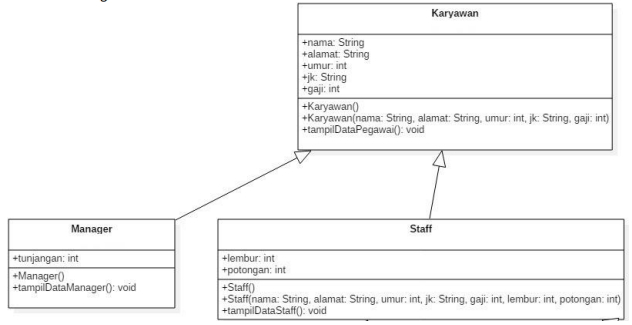
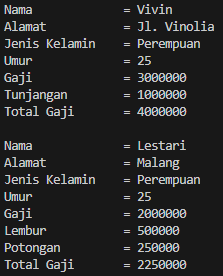
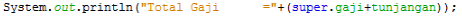
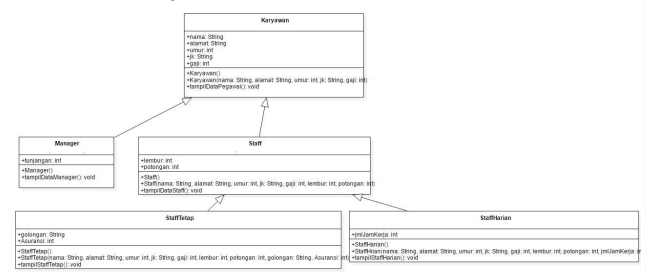
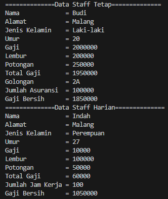
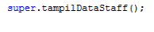
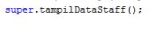
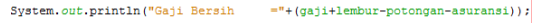
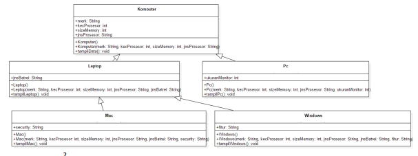
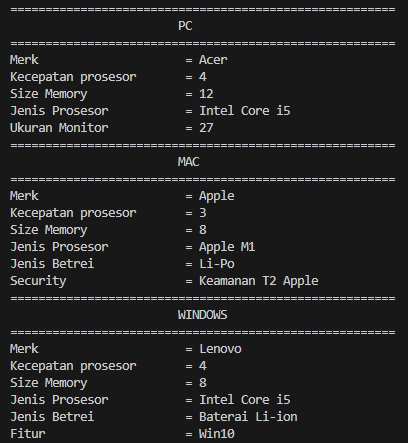

# Laporan Praktikum Pertemuan 6 (2)

# Jobsheet 6: Inheritance (Pewarisan) 2

## Data Mahasiswa
Nama    : Chamillatul Luqiana Agustin

Nim     : 2241720020

Kelas   : TI-2C

# Percobaan 

# Percobaan 1

## A. Tahapan Percobaan
Perhatikan diagram class dibawah ini:



1. Buatlah class Karyawan
    ```java
    package Percobaan;

    public class Karyawan {
        public String nama, alamat, jk;
        public int umur, gaji;

        public Karyawan() {

        }

        public Karyawan(String nama, String alamat, String jk, int umur, int gaji) {
            this.nama = nama;
            this.alamat = alamat;
            this.jk = jk;
            this.umur = umur;
            this.gaji = gaji;
        }

        public void tampilDataKaryawan() {
            System.out.println("Nama\t\t = " +nama);
            System.out.println("Alamat\t\t = " +alamat);
            System.out.println("Jenis Kelamin\t = " +jk);
            System.out.println("Umur\t\t = " +umur);
            System.out.println("Gaji\t\t = " +gaji);
        }
    }
    ```
2. Buatlah class Manager
    ```java
    package Percobaan;

    public class Manager extends Karyawan {
        public int tunjangan;

        public Manager() {

        }

        public void tampilDataManager() {
            super.tampilDataKaryawan();
            System.out.println("Tunjangan\t = " +tunjangan);
            System.out.println("Total Gaji\t = " +(super.gaji+tunjangan));
            System.out.println();
        }
    }
    ```
3. Buatlah class Staff
    ```java
    package Percobaan;

    public class Staff extends Karyawan {
        public int lembur, potongan;

        public Staff() {

        }

        public Staff(String nama, String alamat, String jk, int umur, int gaji, int lembur, int potongan) {
            super(nama, alamat, jk, umur, gaji);
            this.lembur = lembur;
            this.potongan = potongan;
        }

        public void tampilDataStaff() {
            super.tampilDataKaryawan();
            System.out.println("Lembur\t\t = " +lembur);
            System.out.println("Potongan\t = " +potongan);
            System.out.println("Total Gaji\t = " +(gaji+lembur-potongan));
        }
    }
    ```
4. Buatlah class inheritance1
    ```java
    package Percobaan;

    public class Inheritance1 {
        public static void main(String[] args) {
            Manager M = new Manager();
            M.nama = "Vivin";
            M.alamat = "Jl. Vinolia";
            M.umur = 25;
            M.jk = "Perempuan";
            M.gaji = 3000000;
            M.tunjangan = 1000000;
            M.tampilDataManager();

            Staff S = new Staff();
            S.nama = "Lestari";
            S.alamat = "Malang";
            S.umur = 25;
            S.jk = "Perempuan";
            S.gaji = 2000000;
            S.lembur = 500000;
            S.potongan = 250000;
            S.tampilDataStaff();
        }
    }
    ```
5. Jalankan program, maka tampilanya adalah sebagai berikut:
    ### OUTPUT
    

## B. Pertanyaan
1. Sebutkan class mana yang termasuk super class dan sub class dari percobaan 1 diatas!

    **Jawaban:**

    1. Super class:
        - Class Karyawan
    2. Sub class: 
        - Class Manager
        - Class Staff

2. Kata kunci apakah yang digunakan untuk menurunkan suatu class ke class yang lain?

     **Jawaban:**

    Untuk menurunkan inheritance suatu class ke class yang lain dalam pemrograman beroirentasi objek dan dalam bahasa Java kata kunci yang digunakan adalah "extends”. 
    
    Kata kunci ”extends" dapat ditambhakan setelah deklarasi nama class, kemudian diikuti nama parent/super class-nya.

3. Perhatikan kode program pada class Manager, atribut apa saja yang dimiliki oleh class tersebut? Sebutkan atribut mana saja yang diwarisi dari class Karyawan!

     **Jawaban:**

    1. Atribut yang dimiliki oleh Class Manager adalah **tunjangan**.
    2. Atribut yang diwarisi dari Class Karyawan:
        - nama: atribut ini merupakan atribut yang diwarsisi dari class Karyawan yang menyimpan nama seorang karyawan.
        - alamat: atribut ini merupakan atribut yang diwarsisi dari class Karyawan yang menyimpan alamat seorang karyawan.
        - gaji: atribut ini merupakan atribut yang diwarsisi dari class Karyawan yang menyimpan nilai gaji seorang karyawan.

4. Jelaskan kata kuncisuper pada potongan program dibawah ini yang terdapat pada class Manager!

    

     **Jawaban:**

    Kata kunci super digunankan untuk merujuk ke super class. Pada potongan program tersebut kata kunci super merujuk pada atrbut gaji dari class Karyawan yang merupakan super class dari class Manager, hal ini berarti class Manager dapat mengambil nilai atribut gaji dari class Karyawan yang kemudian nilai atribut tunjangan dari class Manager ditambahkan dengan atribut gaji untuk menghitung nilai total gaji.

5. Program pada percobaan 1 diatas termasuk dalam jenis inheritance apa? Jelaskan alasannya!

     **Jawaban:**

    Program pada percobaan 1 di atas termasuk dalam jenis **inheritance single**.

    Dalam "Single Inheritance" subclass (kelas turunan) hanya dapat memiliki satu superclass (kelas induk), dan dalam kasus ini, class "Manager" dan class "Staff" adalah dua subclass yang mengambil sifat dan perilaku dari satu superclass yang sama, yaitu class "Karyawan". Dengan kata lain "Manager" dan "Staff" adalah turunan dari "Karyawan", dan ini adalah contoh dari pewarisan tunggal (Single Inheritance) dalam pemrograman berorientasi objek.

# Percobaan 2

## A. Tahapan Percobaan
1. Perhatikan digram class dibawah ini

    

2. Berdasarkan program yang sudah anda buat pada percobaan 1 sebelumnya tambahkan dua class yaitu class StaffTetap dan class StaffHarian. Kode Programnya adalah sebagai berikut

    ### Class StaffTetap.java
    ```java
    package Percobaan;

    public class StaffTetap extends Staff {
        public String golongan;
        public int asuransi;

        public StaffTetap() {

        }

        public StaffTetap(String nama, String alamat, String jk, int umur, int gaji, int lembur, int potongan, String golongan, int asuransi) {
            super(nama, alamat, jk, umur, gaji, lembur, potongan);
            this.golongan = golongan;
            this.asuransi = asuransi;
        }

        public void tampilStaffTetap() {
            System.out.println("==============Data Staff Tetap==============");
            super.tampilDataStaff();
            System.out.println("Golongan\t = " +golongan);
            System.out.println("Jumlah Asuransi\t = " +asuransi);
            System.out.println("Gaji Bersih\t = " +(gaji+lembur-potongan-asuransi));
        }
    }
    ```

    ### Class StaffHarian.java
    ```java
    package Percobaan;

    public class StaffHarian extends Staff {
        public int jmlJamKerja;

        public StaffHarian() {

        }

        public StaffHarian(String nama, String alamat, String jk, int umur, int gaji, int lembur, int potongan, int jmlJamKerja) {
            super(nama, alamat, jk, umur, gaji, lembur, potongan);
            this.jmlJamKerja = jmlJamKerja;
        }

        public void tampilStaffHarian() {
            System.out.println("==============Data Staff Harian==============");
            super.tampilDataStaff();
            System.out.println("Jumlah Jam Kerja = " +jmlJamKerja);
            System.out.println("Gaji Bersih\t = " +(gaji*jmlJamKerja+lembur-potongan));
        }
    }
    ```

3. Setelah membuat dua class diatas kemudian edit class inheritance1.java menjadisebagai berikut:
    ```java
    package Percobaan;

    public class Inheritance1 {
        public static void main(String[] args) {
            StaffTetap ST = new StaffTetap("Budi", "Malang", "Laki-laki", 20, 2000000, 200000, 250000, "2A", 100000);
            ST.tampilStaffTetap();

            StaffHarian SH = new StaffHarian("Indah", "Malang", "Perempuan", 27, 10000, 100000, 50000, 100);
            SH.tampilStaffHarian();
        }
    }
    ``` 

4. Jalankan program maka tampilanny adalah sebagai berikut:
    ### OUTPUT
    

## B. Pertanyaan
1. Berdasarkan class diatas manakah yang termasuk single inheritance dan mana yang termasuk multilevel inheritance?

    **Jawaban:**

    1. Single Inharitance:
        - Class Manager dan Staff adalah contoh dari single inheritance. Keduanya merupakan subclass dari superclass Karyawan. Dalam kasus ini, Karyawan adalah superclass tunggal bagi kedua class tersebut.
    2. Multilevel Inheritance:
        - Class StaffTetap dan StaffHarian adalah contoh dari multilevel inheritance. Class StaffTetap adalah subclass dari Staff, dan Staff sendiri adalah subclass dari Karyawan. Ini menciptakan tingkat inheritance yang lebih dari satu, sehingga menjadi multilevel inheritance. Jadi Karyawan adalah superclass, Staff adalah turunan pertama, kemudian StaffTetap dan StaffHarian adalah turunan dari Staff.

2. Perhatikan kode program class StaffTetap dan StaffHarian, atribut apa saja yang dimiliki oleh class tersebut? Sebutkan atribut mana saja yang diwarisi dari class Staff!

    **Jawaban:**

    ### Class StaffTetap

    1. Atribut yang dimiliki:
        - golongan
        - asuransi
    2. Atribut yang diwarisi dari class Staff:
        - nama
        - alamat
        - jk
        - umur
        - gaji
        - lembur
        - potongan

    ### Class StaffHarian

    1. Atribut yang dimiliki:
        - jmlJamKerja
    2. Atribut yang diwarisi dari class Staff:
        - nama
        - alamat
        - jk
        - umur
        - gaji
        - lembur
        - potongan
        

3. Apakah fungsi potongan program berikut pada class StaffHarian

    

    **Jawaban:**

    Potongan program tersebut digunakan untuk memanggil constructor dari superclass "Staff" dengan memberikan nilai-nilai parameter yang sesuai. Ini memastikan bahwa atribut class StaffHarian memiliki informasi yang lengkap dan benar untuk atribut-atribut yang diwarisi dari class Staff, sehingga atribut tersebut dapat diinisialisasi dengan benar. Atau bisa dikatakan penggunaan super dalam constructor ini memungkinkan atribut StaffHarian untuk mewarisi dan menginisialisasi atribut-atribut yang ada di class Staff.

4. Apakah fungsi potongan program berikut pada class StaffHarian

    

    **Jawaban:**

    Fungsi dari super.tampilDataStaff(); adalah untuk memanggil metode tampilDataStaff() dari class Staff dalam class StaffHarian. Ini akan menampilkan data staff seperti nama, alamat, jenis kelamin, umur, gaji, lembur, dan potongan yang telah diwarisi dari class Staff.

5. Perhatikan kode program dibawah ini yang terdapat pada class StaffTetap

    

    Terlihat dipotongan program diatas atribut gaji, lembur dan potongan dapat diakses langsung. Kenapa hal ini bisa terjadi dan bagaimana class StaffTetap memiliki atribut gaji, lembur, dan potongan padahal dalam class tersebut tidak dideklarasikan atribut gaji, lembur, dan potongan?

    **Jawaban:**

    Atribut-atribut gaji, lembur, dan potongan dapat diakses langsung dalam class StaffTetap karena class StaffTetap adalah subclass dari Staff. Yang dimana atribut-atribut ini adalah atribut yang diwarisi (inherited) dari superclass Staff ke dalam class StaffTetap. Meskipun atribut-atribut tersebut tidak dideklarasikan ulang secara eksplisit dalam class StaffTetap, class StaffTetap memiliki akses ke atribut-atribut tersebut karena mereka telah didefinisikan dalam class Staff.

# Tugas
1. Buatlah sebuah program dengan konsep pewarisan seperti pada class diagram berikut ini. Kemudian buatlah instansiasi objek untuk menampilkan data pada class Mac, Windows dan Pc!.

    

    **Jawaban:**

    ### KODE PROGRAM
    ### Class Komputer
    ```java
    package Tugas;

    public class Komputer {
        public String merk;
        public int kecProsesor;
        public int sizeMemory;
        public String jnsProsesor;

        Komputer() {

        }

        public Komputer(String merk, int kecProsesor, int sizeMemory, String jnsProsesor) {
            this.merk = merk;
            this.kecProsesor = kecProsesor;
            this.sizeMemory = sizeMemory;
            this.jnsProsesor = jnsProsesor;
        }

        public void tampilData() {
            System.out.println("Merk\t\t\t = " +merk);
            System.out.println("Kecepatan prosesor\t = " +kecProsesor);
            System.out.println("Size Memory\t\t = " +sizeMemory);
            System.out.println("Jenis Prosesor\t\t = " +jnsProsesor);
        }
    }
    ```

    ### Class Leptop
    ```java
    package Tugas;

    public class Leptop extends Komputer{
        public String jnsBatrei;

        Leptop() {

        }

        public Leptop(String merk, int kecProsesor, int sizeMemory, String jnsProsesor, String jnsBatrei) {
            super(merk, kecProsesor, sizeMemory, jnsProsesor);
            this.jnsBatrei = jnsBatrei;
        }

        public void tampilLeptop() {
            super.tampilData();
            System.out.println("Jenis Betrei\t\t = " +jnsBatrei);
        }
    }
    ```

    ### Class Pc
    ```java
    package Tugas;

    public class Pc extends Komputer {
        public int ukuranMonitor;

        Pc() {

        }

        public Pc(String merk, int kecProsesor, int sizeMemory, String jnsProsesor, int ukuranMonitor) {
            super(merk, kecProsesor, sizeMemory, jnsProsesor);
            this.ukuranMonitor = ukuranMonitor;
        }

        public void tampilPc() {
            System.out.println("=======================================================");
            System.out.println("\t\t\tPC\t\t\t");
            System.out.println("=======================================================");
            super.tampilData();
            System.out.println("Ukuran Monitor\t\t = " +ukuranMonitor);
        }
    }
    ```    

    ### Class Mac
    ```java
    package Tugas;

    public class Mac extends Leptop {
        public String security;

        Mac() {

        }

        public Mac(String merk, int kecProsesor, int sizeMemory, String jnsProsesor, String jnsBatrei, String security) {
            super(merk, kecProsesor, sizeMemory, jnsProsesor, jnsBatrei);
            this.security = security;
        }

        public void tampilMac() {
            System.out.println("=======================================================");
            System.out.println("\t\t\tMAC\t\t\t");
            System.out.println("=======================================================");
            super.tampilLeptop();
            System.out.println("Security\t\t = " +security);
        }
    }
    ```

    ### Class Windows
    ```java
    package Tugas;

    public class Windows extends Leptop{
        public String fitur;

        Windows() {

        }

        public Windows(String merk, int kecProsesor, int sizeMemory, String jnsProsesor, String jnsBatrei, String fitur) {
            super(merk, kecProsesor, sizeMemory, jnsProsesor, jnsBatrei);
            this.fitur = fitur;
        }

        public void tampilWindows() {
            System.out.println("=======================================================");
            System.out.println("\t\t\tWINDOWS\t\t");
            System.out.println("=======================================================");
            super.tampilLeptop();
            System.out.println("Fitur\t\t\t = " +fitur);
        }
    }
    ```

    ### Class Main
    ```java
    package Tugas;

    public class Main {
        public static void main(String[] args) {
            Komputer K = new Komputer("Dell", 5, 32, "Intel Core i9");

            Leptop L = new Leptop("HP", 4, 8, "AMD Ryzen 5", "Baterai Li-ion 3-cell");

            Pc P = new Pc("Acer", 4, 12, "Intel Core i5", 27);
            P.tampilPc();

            Mac mac = new Mac("Apple", 3, 8, "Apple M1", "Li-Po", "Keamanan T2 Apple");
            mac.tampilMac();

            Windows wd = new Windows("Lenovo", 4, 8, "Intel Core i5", "Baterai Li-ion", "Win10");
            wd.tampilWindows();
        }
    }
    ```

    ### OUTPUT
    