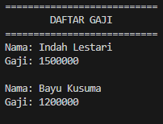

# Laporan Praktikum Pertemuan 6

# Jobsheet 6: Inheritance (Pewarisan)

## Data Mahasiswa
Nama    : Chamillatul Luqiana Agustin

Nim     : 2241720020

Kelas   : TI-2C

# Percobaan

# Percobaan 1: Extends

## A. Tahapan Percobaan
1. Buatlah sebuah class parent/superclass dengan nama ClassA.java
    ```java
    package Percobaan1;

    public class ClassA {
        public int x;
        public int y;

        public void getNilai() {
            System.out.println("nilai x: "+ x );
            System.out.println("nilai y: "+ y );
        }
    }
    ```
2. Buatlah sebuah class anak/subclass dengan nama ClassB.java
    ```java
    package Percobaan1;

    public class ClassB {
        public int z;

        public void getNilaiZ() {
            System.out.println("nilai z: " + z);
        }

        public void getJumlah() {
            System.out.println("jumlah: "+ (x+y+z));
        }
    }
    ```
3. Buatlah class Percobaan1.java untuk menjalankan program diatas!
    ```java
    package Percobaan1;

    public class Percobaan1 {
        public static void main(String[] args) {
            ClassB hitung = new ClassB();
            hitung.x=20;
            hitung.y=30;
            hitung.z=5;
            hitung.getNilai();
            hitung.getNilaiZ();
            hitung.getJumlah();
        }
    }
    ```
4. Jalankan program diatas, kemudian amati apa yang terjadi!

    ### OUTPUT
    

    Kode program tersebut error saat dijalankan, karena pada Classb mencoba mengakses variabel x dan y, tetapi variabel tersebut hanya dideklarasikan di ClassA saja, dan ClassB tidak mewarisi atau memiliki akses ke variabel tersebut.

## B. Pertanyaan
1. Pada percobaan 1 diatas program yang dijalankan terjadi error, kemudian perbaiki sehingga program tersebut bisa dijalankan dan tidak error!

    **Jawaban:**

    Supaya kode program tersebut tidak error perlu membuat hubungan antara ClassA dan ClassB, misalnya dengan cara mewarisi ClassA ke ClassB. Berikut ini adalah perbaikan pada kode program pada ClassB:
    ```java
    package Percobaan1;

    public class ClassB extends ClassA{
        public int z;

        public void getNilaiZ() {
            System.out.println("nilai z: " + z);
        }

        public void getJumlah() {
            System.out.println("jumlah: "+ (x+y+z));
        }
    }
    ```

    ### OUTPUT

    

2. Jelaskan apa penyebab program pada percobaan 1 ketika dijalankan terdapat error!

    **Jawaban:**

    Penyebab utama kesalahan dalam program ini adalah bahwa ClassB tidak mewarisi atau memiliki akses langsung ke variabel x dan y yang dideklarasikan dalam ClassA. Dalam program ini, ClassA dan ClassB adalah dua kelas yang terpisah dan tidak ada hubungan warisan antara keduanya. Dan method getNilai() juga tidak dideklarasikan dalam ClassB, sehingga mencoba memanggilnya pada objek ClassB menghasilkan kesalahan atau error.

# Percobaan 2: Hak Akses

## A. Tahapan Percobaan
1. Buatlah sebuah class parent/superclass dengan nama ClassA.java
    ```java
    package Percobaan2;

    public class ClassA {
        private int x;
        private int y;

        public void setX(int x) {
            this.x = x;
        }

        public void setY(int y) {
            this.y = y;
        }

        public void getNilai() {
            System.out.println("nilai x: " + x);
            System.out.println("nilai y: " + y);
        }
    }
    ```
2. Buatlah sebuah class anak/subclass dengan nama ClassB.java
    ```java
    package Percobaan2;

    public class ClassB {
        private int z;

        public void setZ(int z) {
            this.z = z;
        }

        public void getNilaiZ() {
            System.out.println("nilai z: " + z);
        }

        public void getJumlah() {
            System.out.println("jumlah: " + (x+y+z));
        }
    }
    ```
3. Buatlah class Percobaan2.java untuk menjalankan program diatas!
    ```java
    package Percobaan2;

    public class Percobaan2 {
        public static void main(String[] args) {
            ClassB hitung = new ClassB();
            hitung.setX(20);
            hitung.setY(30);
            hitung.setZ(5);
            hitung.getNilai();
            hitung.getNilaiZ();
            hitung.getJumlah();
        }
    }
    ```
4. Jalankan program diatas, kemudian amati apa yang terjadi!

    ### OUTPUT

    

    Kode program tersebut error saat dijalankan, karena mencoba untuk mengakses metode dan variabel dari ClassA dalam ClassB, tetapi ClassA tidak diwariskan atau di-extend oleh ClassB.

## B. Pertanyaan
1. Pada percobaan 2 diatas program yang dijalankan terjadi error, kemudian perbaiki sehingga program tersebut bisa dijalankan dan tidak error!

    **Jawaban:**

    Supaya kode program tersebut tidak error perlu mengakses metode setX(int) dan setY(int) dari ClassB. Dan perlu menjadikan ClassA sebagai superclass atau menggunakan objek ClassA. Untuk mengakses variabel x dan y dari ClassA, juga perlu memodifikasi aksesibilitasnya ke protected. Berikut ini adalah perbaikan pada kode program pada ClasA dan ClassB:
    ```java
    package Percobaan2;

    public class ClassA {
        protected int x;
        protected int y;

        public void setX(int x) {
            this.x = x;
        }

        public void setY(int y) {
            this.y = y;
        }

        public void getNilai() {
            System.out.println("nilai x: " + x);
            System.out.println("nilai y: " + y);
        }
    }
    ```

    ```java
    package Percobaan2;

    public class ClassB extends ClassA {
        private int z;

        public void setZ(int z) {
            this.z = z;
        }

        public void getNilaiZ() {
            System.out.println("nilai z: " + z);
        }

        public void getJumlah() {
            System.out.println("jumlah: " + (x+y+z));
        }
    }
    ```

    ### OUTPUT

    

2. Jelaskan apa penyebab program pada percobaan 2 ketika dijalankan terdapat error!

    **Jawaban:**

    Penyebab program pada percobaan 2 ketika dijalankan terdapat error adalah bahwa ClassA tidak diwariskan atau di-extend oleh ClassB, sehingga tidak memiliki akses langsung ke metode setX(int) dan setY(int) atau variabel x dan y. Dan tidak ada objek ClassA atau hubungan yang dibuat, jadi meskipun ClassA memiliki metode setX(int) dan setY(int), pada program tersebut tidak membuat objek ClassA atau menginisialisasi objek ClassA di dalam ClassB, sehingga tidak dapat mengakses metode tersebut.

# Percobaan 3: Super

## A. Tahapan Percobaan
1. Buatlah sebuah class parent/superclass dengan nama Bangun.java
    ```java
    package Percobaan3;

    public class Bangun {
        protected double phi;
        protected int r;
    }
    ```
2. Buatlah sebuah class anak/subclass dengan nama Tabung.java
    ```java
    package Percobaan3;

    public class Tabung extends Bangun {
        protected int t;

        public void setSuperPhi(double phi) {
            super.phi = phi;
        }

        public void setSuperR(int r) {
            super.r = r;
        }

        public void setT(int t) {
            this.t = t;
        }

        public void volume() {
            System.out.println("Volume Tabung adalah: "+(super.phi*super.r*super.r*this.t));
        }
    }
    ```
3. Buatlah class Percobaan3.java untuk menjalankan program diatas!
    ```java
    package Percobaan3;

    public class Percobaan3 {
        public static void main(String[] args) {
            // TODO code application login code
            Tabung tabung = new Tabung();
            tabung.setSuperPhi(3.14);
            tabung.setSuperR(10);
            tabung.setT(3);
            tabung.volume();
        }
    }
    ```
4. Jalankan program diatas!

    ### OUTPUT
    

## B. Pertanyaan
1. Jelaskan fungsi “super” pada potongan program berikut di class Tabung!

    

    **Jawaban:**

    Penggunaan super dalam Class Tabung digunakan untuk merujuk dan mengakses atribut (variabel) dari Class Bangun. Dalam contoh yang diberikan, super.phi dan super.r digunakan untuk mengatur nilai dari atribut phi dan r yang berasal dari Class Bangun. Hal ini memungkinkan Class Tabung untuk menggunakan dan menginisialisasi atribut-atribut tersebut dalam perhitungan volume tabung.

2. Jelaskan fungsi “super” dan “this” pada potongan program berikut di class Tabung!

    

    **Jawaban:**

    - super.phi dan super.r digunakan untuk mengakses atribut phi dan r dari class Bangun atau superclass. Ini digunakan untuk mendapatkan nilai phi dan r dari class Bangun dan digunakan dalam perhitungan volume tabung di class Tabung.
    - this.t digunakan untuk mengakses atribut t dari class Tabung. this adalah referensi ke objek saat ini, dan this.t digunakan untuk mendapatkan nilai atribut t dari objek Tabung yang sedang digunakan.

    Dengan demikian, dalam metode volume() yang diberikan, super digunakan untuk mengakses atribut dari class Bangun, dan this digunakan untuk mengakses atribut dari class Tabung dalam perhitungan volume tabung.

3. Jelaskan mengapa pada class Tabung tidak dideklarasikan atribut “phi” dan “r” tetapi class tersebut dapat mengakses atribut tersebut!

    **Jawaban:**

    Atribut "phi" dan "r" dalam class Tabung dapat diakses karena telah dideklarasikan sebagai protected dalam class Bangun atau superclassnya. Ini memungkinkan subclass seperti Tabung untuk mengakses atribut tersebut tanpa perlu mendeklarasikan atribut 'phi" dan "r" secara eksplisit dalam class Tabung. Penggunaan tingkat akses protected pada atribut ini memungkinkan warisan (inheritance) dan akses ke atribut tersebut dalam subclass.

# Percobaan 4: Super Constructor

## A. Tahapan Percobaan
1. Buatlah tiga file dengan nama ClassA.java , ClassB.java , dan ClassC.java, seperti pada kode program dibawah ini!

    **ClassA.java**
    ```java
    package Percobaan4;

    public class ClassA {
        ClassA() {
            System.out.println("konstruktor A dijalankan");
        }
    }
    ```

    **ClassB.java**
    ```java
    package Percobaan4;

    public class ClassB extends ClassA {
        ClassB() {
            System.out.println("konstruktor B dijalankan");
        }
    }
    ```

    **ClassC.java**
    ```java
    package Percobaan4;

    public class ClassC extends ClassB{
        ClassC() {
            System.out.println("konstruktor C dijalankan");
        }    
    }
    ```

2. Buatlah class Percobaan4.java untuk menjalankan program diatas!
    ```java
    package Percobaan4;

    public class Percobaan4 {
        public static void main(String[] args) {
            // TODO code application logic here
            ClassC test = new ClassC();
        }
    }
    ```

3. Jalankan program kemudian amati apa yang terjadi!

    ### OUTPUT
    

## B. Pertanyaan
1. Pada percobaan 4 sebutkan mana class yang termasuk superclass dan subclass, kemudian jelaskan alasannya!

    **Jawaban:**

    - **ClassA adalah superclass**, karena tidak memiliki kelas yang meng-extend (inherit) darinya. Jadi ClassA adalah kelas dasar dalam hierarki kelas ini.
    - **ClassB adalah subclass dari ClassA**, karena meng-extend (inherit) dari ClassA. Sebagai hasilnya, ClassB mewarisi sifat-sifat dan perilaku dari ClassA.
    - **ClassC adalah subclass dari ClassB**, karena meng-extend (inherit) dari ClassB. Ini membuatnya menjadi turunan kedua dalam rantai warisan (inheritance) dan mewarisi sifat-sifat dan perilaku dari baik ClassB maupun ClassA.

2. Ubahlah isi konstruktor default ClassC seperti berikut:

    

    Tambahkan kata super() di baris Pertaman dalam konstruktor defaultnya. Coba jalankan kembali class Percobaan4 dan terlihat tidak ada perbedaan dari hasil outputnya!

    **Jawaban:**

    ### KODE PROGRAM
    ```java
    package Percobaan4;

    public class ClassC extends ClassB{
        ClassC() {
            super();
            System.out.println("konstruktor C dijalankan");
        }    
    }
    ```
    ### OUTPUT
    
    Hasil outputnya masih akan tetap sama dengan versi sebelumnya. Output akan terlihat seperti ini:

    

3. Ublah isi konstruktor default ClassC seperti berikut:

    

    Ketika mengubah posisi super() dibaris kedua dalam kontruktor defaultnya dan terlihat ada error. Kemudian kembalikan super() kebaris pertama seperti sebelumnya, maka errornya akan hilang. Perhatikan hasil keluaran ketika class Percobaan4 dijalankan. Kenapa bisa tampil output seperti berikut pada saat instansiasi objek test dari class ClassC

    

    Jelaskan bagaimana urutan proses jalannya konstruktor saat objek test dibuat!

    **Jawaban:**

    Urutan proses jalannya konstruktor saat objek test dibuat sebagai berikut:
    
    1. Pada Class Percobaan4 atau class main membuat objek test dari ClassC dengan pernyataan ClassC test = new ClassC();. Hal ini akan mengakibatkan konstruktor ClassC yang pertama kali dijalankan.
    2. Dalam konstruktor ClassC, pertama-tama super(); dipanggil, dan akan mengacu pada konstruktor ClassB karena ClassC adalah subkelas dari ClassB.
    3. Dalam konstruktor ClassB, super(); dipanggil, dan akan mengacu pada konstruktor ClassA karena ClassB adalah subkelas dari ClassA.
    4. Kemudian dalam konstruktor ClassA, konstruktor default tanpa parameter dari ClassA akan dieksekusi.
    5. Sehingga, urutan proses jalannya konstruktor saat objek test dari ClassC dibuat adalah sebagai berikut:

        1. Konstruktor ClassA dijalankan (dari super(); di ClassB).
        2. Konstruktor ClassB dijalankan (dari super(); di ClassC).
        3. Konstruktor ClassC dijalankan (konstruktor objek test yang Anda buat).

4. Apakah fungsi super() pada potongan program dibawah ini di ClassC!

    

    **Jawaban:**

    Fungsi 'super();' pada konstruktor ClassC digunakan untuk memanggil konstruktor dari kelas superclassnya, yaitu ClassB. Dengan melakukan itu, konstruktor ClassB dan konstruktor kelas superclassnya dapat dieksekusi sebelum kode dalam konstruktor ClassC dijalankan. Hal ini adalah pewarisan (inheritance) untuk memastikan bahwa inisialisasi yang diperlukan dalam hierarki kelas dijalankan dengan benar sebelum inisialisasi kelas saat ini.

# Tugas
1. Buatlah sebuah program dengan konsep pewarisan seperti pada class diagram berikut ini. Kemudian buatlah instansiasi objek untuk menampilkan data nama pegawai dan gaji yang didapatkannya.

    

    **Jawaban:**

    ### KODE PROGRAM

    #### Class Pegawai
    ```java
    package Tugas;

    public class Pegawai {
        private String nip;
        private String nama;
        private String alamat;

        public Pegawai(String nip, String nama, String alamat) {
            this.nip = nip;
            this.nama = nama;
            this.alamat = alamat;
        }

        public String getNama() {
            return nama;
        }

        public int getGaji() {
            return 0; 
        }
    }
    ```

    #### Class DaftarGaji
    ```java
    package Tugas;

    public class DaftarGaji {
        private Pegawai[] listPegawai;
        private int jumlahPegawai;

        public DaftarGaji(int jumlahPegawai) {
            listPegawai = new Pegawai[jumlahPegawai];
            jumlahPegawai = 0;
        }

        public void addPegawai(Pegawai pegawai) {
            if (jumlahPegawai < listPegawai.length) {
                listPegawai[jumlahPegawai] = pegawai;
                jumlahPegawai++;
            } else {
                System.out.println("Daftar pegawai penuh. Tidak bisa menambahkan pegawai lagi.");
            }
        }
        
        public void printSemuaGaji() {
            System.out.println("===========================");
            System.out.println("\tDAFTAR GAJI\t");
            System.out.println("===========================");
            for (int i = 0; i < jumlahPegawai; i++) {
                Pegawai pegawai = listPegawai[i];
                System.out.println("Nama: " + pegawai.getNama());
                System.out.println("Gaji: " + pegawai.getGaji());
                System.out.println();
            }
        }
    }
    ```

    #### Class Dosen
    ```java
    package Tugas;

    public class Dosen extends Pegawai {
        private int jumlahSKS;
        private static int TARIF_SKS = 100000;

        public Dosen(String nip, String nama, String alamat) {
            super(nip, nama, alamat);
            this.jumlahSKS = 0;
        }

        public void setSKS(int jumlahSKS) {
            this.jumlahSKS = jumlahSKS;
        }

        public int getGaji() {
            return jumlahSKS * TARIF_SKS;
        }
    }
    ```

    #### Class Main
    ```java
    package Tugas;

    public class Main {
        public static void main(String[] args) {
            DaftarGaji daftarGaji = new DaftarGaji(5);

            Dosen dosen1 = new Dosen("11234", "Indah Lestari", "Jl. Bunga Kertas");
            dosen1.setSKS(15);
            Dosen dosen2 = new Dosen("55678", "Bayu Kusuma", "Jl. Bandung");
            dosen2.setSKS(12);

            daftarGaji.addPegawai(dosen1);
            daftarGaji.addPegawai(dosen2);

            daftarGaji.printSemuaGaji();
        }
    }
    ```

    ### OUTPUT
    