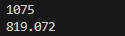

# Laporan Praktikum Pertemuan 11

# Jobsheet 9: Overloading Dan Overriding

## Data Mahasiswa
Nama    : Chamillatul Luqiana Agustin

Nim     : 2241720020

Kelas   : TI-2C

# 3. Praktikum 

# 3.1 Percobaan 1
Untuk kasus contoh berikut ini, terdapat tiga kelas, yaitu Karyawan, Manager, dan Staff. Class Karyawan merupakan superclass dari Manager dan Staff dimana subclass Manager dan 
Staff memiliki method untuk menghitung gaji yang berbeda


# 3.2 Karyawan
```java
public class Karyawan {
    private String nama;
    private String nip;
    private String golongan;
    private double gaji;

    public void setNama(String nama) {
        this.nama=nama;
    }

    public void setNip(String nip) {
        this.nip=nip;
    }

    public void setGolongan(String golongan) {
        this.golongan=golongan;

        switch (golongan.charAt(0)) {
            case '1':this.gaji=5000000;
            break;
            case '2':this.gaji=3000000;
            break;
            case '3':this.gaji=2000000;
            break;
            case '4':this.gaji=1000000;
            break;
            case '5':this.gaji=750000;
            break;
        }
    }

    public void setGaji(double gaji) {
        this.gaji=gaji;
    }

    public String getNama() {
        return nama;
    }

    public String getNip() {
        return nip;
    }

    public String getGolongan() {
        return golongan;
    }

    public double getGaji() {
        return gaji;
    }
}
```

# 3.3 Staff
```java
public class Staff extends Karyawan{
    private int lembur;
    private double gajiLembur;

    public void setLembur(int lembur) {
        this.lembur=lembur;
    }

    public int getLembur() {
        return lembur;
    }

    public void setGajiLembur(double gajiLembur) {
        this.gajiLembur=gajiLembur;
    }

    public double getGajiLembur() {
        return gajiLembur;
    }

    // Overloading
    public double getGaji(int lembur, double gajiLembur) {
        return super.getGaji()+lembur*gajiLembur;
    }

    // Overriding
    public double getGaji() {
        return super.getGaji()+lembur*gajiLembur;
    }

    public void lihatInfo() {
        System.out.println("NIP\t\t: " +this.getNip());
        System.out.println("Nama\t\t: " + this.getNama());
        System.out.println("Golongan\t: " +this.getGolongan());
        System.out.println("Jml Libur\t: " +this.getLembur());
        System.out.printf("Gaji Lembur\t: %.0f\n", this.getGajiLembur());
        System.out.printf("Gaji\t\t: %.0f\n", this.getGaji());

    }
}
```

# 3.4 Manager
```java
public class Manager extends Karyawan {
    private double tunjangan;
    private String bagian;
    private Staff st[];

    public void setTunjangan(double tunjangan) {
        this.tunjangan=tunjangan;
    }

    public double getTunjangan() {
        return tunjangan;
    }

    public void setBagian(String bagian) {
        this.bagian=bagian;
    }

    public String getBagian() {
        return bagian;
    }

    public void setStaff(Staff st[]) {
        this.st=st;
    }

    public void viewStaff() {
        int i;
        System.out.println("--------------------------------------");
        for(i = 0; i < st.length; i++) {
            st[i].lihatInfo();
        }
        System.out.println("--------------------------------------");
    }
    public void lihatInfo() {
        System.out.println("Manager\t\t: " +this.getBagian());
        System.out.println("NIP\t\t: " +this.getNip());
        System.out.println("Nama\t\t: " +this.getNama());
        System.out.println("Golongan\t: " +this.getGolongan());
        System.out.printf("Tunjangan\t: %.0f\n", this.getTunjangan());
        System.out.printf("Gaji\t\t: %.0f\n", this.getGaji());
        System.out.println("Bagian\t\t: "+this.getBagian());
        this.viewStaff();
    }

    public double getGaji() {
        return super.getGaji()+tunjangan;
    }
}
```

# 3.5 Utama
```java
public class Utama {
    public static void main(String[] args) {
        System.out.println("Program Testing Class Manager & Staff");
        Manager man[]=new Manager[2];
        Staff staff1[]=new Staff[2];
        Staff staff2[]=new Staff[3];

        // Pembuatan Manager
        man[0]=new Manager();
        man[0].setNama("Tedjo");
        man[0].setNip("101");
        man[0].setGolongan("1");
        man[0].setTunjangan(5000000);
        man[0].setBagian("Administrasi");

        man[1]=new Manager();
        man[1].setNama("Atika");
        man[1].setNip("102");
        man[1].setGolongan("1");
        man[1].setTunjangan(2500000);
        man[1].setBagian("Pemasaran");

        // Pembuatan Staff1
        staff1[0]=new Staff();
        staff1[0].setNama("Usman");
        staff1[0].setNip("0003");
        staff1[0].setGolongan("2");
        staff1[0].setLembur(10);
        staff1[0].setGajiLembur(10000);

        staff1[1]=new Staff();
        staff1[1].setNama("Anugrah");
        staff1[1].setNip("0005");
        staff1[1].setGolongan("2");
        staff1[1].setLembur(10);
        staff1[1].setGajiLembur(55000);
        man[0].setStaff(staff1);

        // Pembuatan Staff2
        staff2[0]=new Staff();
        staff2[0].setNama("Hendra");
        staff2[0].setNip("0004");
        staff2[0].setGolongan("3");
        staff2[0].setLembur(15);
        staff2[0].setGajiLembur(5500);

        staff2[1]=new Staff();
        staff2[1].setNama("Arie");
        staff2[1].setNip("0006");
        staff2[1].setGolongan("4");
        staff2[1].setLembur(5);
        staff2[1].setGajiLembur(100000);

        staff2[2]=new Staff();
        staff2[2].setNama("Mentari");
        staff2[2].setNip("0007");
        staff2[2].setGolongan("3");
        staff2[2].setLembur(6);
        staff2[2].setGajiLembur(20000);
        man[1].setStaff(staff2);

        // Cetak informasi dari manager + staffnya
        man[0].lihatInfo();
        man[1].lihatInfo();
    }
}
```

## OUTPUT


# 4. Latihan
## KODE PROGRAM
```java
package Latihan;

public class PerkalianKu {
    void perkalian(int a, int b) {
        System.out.println(a * b);
    }

    void perkalian(int a, int b, int c) {
        System.out.println(a * b * c);
    }

    public static void main(String[] args) {
        PerkalianKu objek = new PerkalianKu();
        objek.perkalian(25, 43);
        objek.perkalian(34, 23, 56);
    }
}
```

## OUTPUT


4.1 Dari source coding diatas terletak dimanakah overloading?

### Jawaban
Overloading terletak pada method perkalian(). Method perkalian() memiliki dua versi, yaitu versi dengan dua parameter dan versi dengan tiga parameter. Dua versi method tersebut memiliki nama yang sama, namun jumlah parameter dan tipe parameternya berbeda.

Berikut kode program yang merupakan overloading:
```java
void perkalian(int a, int b, int c) {
    System.out.println(a * b * c);
}
```

4.2 Jika terdapat overloading ada berapa jumlah parameter yang berbeda?

### Jawaban
Jumlah parameter yang berbeda dalam kedua metode tersebut adalah sebagai berikut:
- Metode pertama void perkalian(int a, int b) memiliki dua parameter.
- Metode kedua void perkalian(int a, int b, int c) memiliki tiga parameter.

Jadi, terdapat dua jumlah parameter yang berbeda dalam metode yang mengalami overloading.

## KODE PROGRAM
```java
package Latihan;

public class PerkalianKu {
    void perkalian(int a, int b) {
        System.out.println(a * b);
    }

    void perkalian(double a, double b) {
        System.out.println(a * b);
    }

    public static void main(String[] args) {
        PerkalianKu objek = new PerkalianKu();
        objek.perkalian(25, 43);
        objek.perkalian(34.56, 23.7);
    }
}
```

## OUTPUT


4.3 Dari source coding diatas terletak dimanakah overloading?

### Jawaban
Overloading terletak pada method perkalian(). Method perkalian() memiliki dua versi, yaitu versi dengan parameter int dan versi dengan parameter double. Dua versi method tersebut memiliki nama yang sama, namun tipe parameternya berbeda.

Berikut kode program yang merupakan overloading:
```java
void perkalian(double a, double b) {
    System.out.println(a * b);
}
```

4.4 Jika terdapat overloading ada berapa tipe parameter yang berbeda?

### Jawaban
Terdapat dua tipe parameter yang berbeda.
- Metode perkalian(int a, int b) memiliki dua parameter bertipeint`.
- Metode perkalian(double a, double b) memiliki dua parameter bertipe double.


## KODE PROGRAM
```java
package Latihan;

public class Ikan {
    public void swim() {
        System.out.println("Ikan bisa berenang");
    }
}

class Piranha extends Ikan{
    public void swim() {
        System.out.println("Piranha bisa berenang");
    }
}

class Fish {
    public static void main(String[] args) {
        Ikan a = new Ikan();
        Ikan b = new Piranha();
        a.swim();
        b.swim();
    }
}
```

## OUTPUT


4.5 Dari source coding diatas terletak dimanakah overriding?

### Jawaban
Dalam kode tersebut terdapat overriding yang terjadi pada metode swim() dalam kelas-kelas Ikan dan Piranha.

Berikut kode program yang merupakan overriding:
```java
public class Ikan {
    public void swim() {
        System.out.println("Ikan bisa berenang");
    }
}
```
```java
class Piranha extends Ikan{
    public void swim() {
        System.out.println("Piranha bisa berenang");
    }
}
```

4.6 Jabarkanlah apabila sourcoding diatas jika terdapat overriding?

### Jawaban
Overriding adalah ketika sebuah metode dalam kelas turunan (subclass) mengimplementasikan ulang metode dengan nama, tipe pengembalian, dan parameter yang sama dari kelas induk (superclass). Dalam hal ini, metode swim() pada kelas Piranha meng-overriding metode swim() pada kelas Ikan.

Jadi, di sini overriding terjadi pada metode swim() yang didefinisikan dalam kelas Piranha yang merupakan turunan dari kelas Ikan.

# 5. Tugas
# 5.1 Overloading
Implementasikan konsep overloading pada class diagram dibawah ini :


### Jawaban

## KODE PROGRAM
## Class Segitiga
```java
package TugasOverloading;

public class Segitiga {
    private int sudut;

    public int totalSudut(int sudutA) {
        sudut = 180 - sudutA;
        System.out.println("Total Sudut Segitiga\t: " + sudut);
        return sudut;
    }

    public int totalSudut(int sudutA, int sudutB) {
        sudut = 180 - (sudutA + sudutB);
        System.out.println("Total Sudut Segitiga\t: " + sudut);
        return sudut;
    }

    public int keliling(int sisiA, int sisiB, int sisiC) {
        int kel = sisiA + sisiB + sisiC;
        System.out.println("Keliling Segitiga\t: " + kel);
        return kel;
    }

    public double keliling(int sisiA, int sisiB) {
        double c = (Math.sqrt(sisiA * sisiA) + Math.sqrt(sisiB * sisiB));
        System.out.println("keliling Segitiga\t: " + c);
        return c;
    }
}
```

## Class MainOverloading
```java
package TugasOverloading;

public class MainOverloading {
    public static void main(String[] args) {
        Segitiga sg = new Segitiga();

        sg.totalSudut(40);
        sg.totalSudut(40, 60);
        sg.keliling(8, 14, 20);
        sg.keliling(8, 14);
    }
}
```

## OUTPUT


# 5.2 Overriding
Implementasikan class diagram dibawah ini dengan menggunakan teknik dynamic method dispatch :


### Jawaban

## KODE PROGRAM
## Class Manusia
```java
package TugasOverriding;

public class Manusia {
    public void bernafas() {
        System.out.println("Manusia Bernafas");
    }

    public void makan() {
        System.out.println("Manusia Makan");
    }
}
```

## Class Dosen
```java
package TugasOverriding;

public class Dosen extends Manusia {
    @Override
    public void makan() {
        System.out.println("Dosen Makan");
    }

    public void lembur() {
        System.out.println("Dosen Lembur");
    }
}
```

## Class Mahasiswa
```java
package TugasOverriding;

public class Mahasiswa extends Manusia {
    @Override
    public void makan() {
        System.out.println("Mahasiswa Makan");
    }

    public void tidur() {
        System.out.println("Mahasiswa Tidur");
    }
}
```

## Class MainOverriding
```java
package TugasOverriding;

public class MainOverriding {
    public static void main(String[] args) {
        Manusia m = new Manusia();
        Mahasiswa mhs = new Mahasiswa();
        Dosen d = new Dosen();

        m.makan();
        m.bernafas();
        d.makan();
        d.lembur();
        mhs.makan();
        mhs.tidur();
    }
}
```

## OUTPUT
