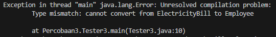

# Laporan Praktikum Pertemuan 12

# Jobsheet 12: Polimorfisme

## Data Mahasiswa
Nama    : Chamillatul Luqiana Agustin

Nim     : 2241720020

Kelas   : TI-2C

# 4. Percobaan 1 - Bentuk dasar polimorfisme
## 4.1. Langkah Percobaan
1. Buat class Employee
    ```java
    public class Employee {
        protected String name;

        public String getEmployeeInfo() {
            return "Name = " + name;
        }
    }
    ```
2. Buat interface Payable
    ```java
    public interface Payable {
        public int getPaymentAmount();
    }
    ```
3. Buat class InternshipEmployee, subclass dari Employee
    ```java
    public class InternshipEmployee extends Employee {
        private int length;

        public InternshipEmployee(String name, int length) {
            this.length = length;
            this.name = name;
        }

        public int getLength() {
            return length;
        }   

        public void setLength(int length) {
            this.length = length;
        }

        @Override
        public String getEmployeeInfo() {
            String info = super.getEmployeeInfo()+"\n";
            info += "Registered as internship employee for " + length + " month/s\n";
            return info;
        }
    }
    ```
4. Buat class PermanentEmployee, subclass dari Employee dan implements ke Payable
    ```java
    public class PermanentEmployee extends Employee implements Payable {
        private int salary;

        public PermanentEmployee(String name, int salary) {
            this.name = name;
            this.salary = salary;
        }

        public int getSalary() {
            return salary;
        }

        public void setSalary(int salary) {
            this.salary = salary;
        }

        @Override
        public int getPaymentAmount() {
            return (int) (salary+0.05*salary);
        }   

        @Override
        public String getEmployeeInfo() {
            String info = super.getEmployeeInfo()+"\n";
            info += "Registered as permanent employee with salary " + salary + "\n";
            return info;
        }
    }
    ```
5. Buat class ElectricityBill yang implements ke interface Payable
    ```java
    public class ElectricityBill implements Payable {
        private int kwh;
        private String category;

        public ElectricityBill(int kwh, String category) {
            this.kwh = kwh;
            this.category = category;
        }

        public int getKwh() {
            return kwh;
        }

        public void setKwh(int kwh) {
            this.kwh = kwh;
        }

        public String getCategory() {
            return category;
        }

        public void setCategory(String category) {
            this.category = category;
        }

        @Override
        public int getPaymentAmount() {
            return kwh+getBasePrice();
        }

        public int getBasePrice() {
            int bPrice = 0;
            switch(category) {
                case "R-1" : bPrice = 100; break;
                case "R-2" : bPrice = 200; break;
            }
            return bPrice;
        }

        public String getBillInfo() {
        return "KWH = "+ kwh + "\n" + "Category = " + category + "("+getBasePrice()+" per KWH)\n";
        }
    }
    ```
6. Buat class Tester1
    ```java
    public class Tester1 {
        public static void main(String[] args) {
            PermanentEmployee pEmp = new PermanentEmployee("Dedik", 500);
            InternshipEmployee iEmp = new InternshipEmployee("Sunarto", 5);
            ElectricityBill eBill = new ElectricityBill(5, "A-1");
            Employee e;
            Payable p;
            e = pEmp;
            e = iEmp;
            p = pEmp;
            p = eBill;
        }
    }
    ```

    ## OUTPUT
    Tidak menghasilkan output atau tidak ada output yang ditampilkan, karena kode program tersebut tidak ada perintah untuk mencetak output ke konsol. Oleh karena itu, meskipun kode program dieksekusi, output tidak akan ditampilkan.

## 4.2. Pertanyaan
1. Class apa sajakah yang merupakan turunan dari class Employee?
    ### Jawaban
    Terdapat dua class yang merupakan turunan dari class Employee, yaitu:
    1. **Class InternshipEmployee:** class ini mewarisi class Employee dan menambahkan atribut length yang mewakili lamanya masa kerja magang.
    2. **Class PermanentEmployee:** class ini mewarisi class Employee dan menambahkan atribut salary yang mewakili gaji karyawan tetap.

2. Class apa sajakah yang implements ke interface Payable?
    ### Jawaban
    Terdapat dua class yang mengimplementasikan interface Payable, yaitu:
    1. **Class PermanentEmployee:** class ini mengimplementasikan interface Payable dan class PermanentEmployee mengimplementasikan metode getPaymentAmount() yang menghitung jumlah pembayaran untuk karyawan tetap berdasarkan gaji mereka.
    2. **Class ElectricityBill:** class ini mengimplementasikan interface Payable dan class ElectricityBill mengimplementasikan metode getPaymentAmount() yang menghitung jumlah pembayaran untuk tagihan listrik berdasarkan jumlah kilowatt-hour (kwh) yang digunakan dan kategori tagihan.

3. Perhatikan class Tester1, baris ke-10 dan 11. Mengapa e, bisa diisi dengan objek pEmp (merupakan objek dari class PermanentEmployee) dan objek iEmp (merupakan objek dari class InternshipEmploye) ?
    ### Jawaban
    Dalam class Tester1 variabel 'e' yang dimana variabel tersebut dideklarasikan sebagai objek dari class 'Employee' dapat diisi dengan objek pEmp (instance dari PermanentEmployee) dan objek iEmp (instance dari InternshipEmployee) dikarenakan kedua kelas tersebut adalah turunan dari kelas Employee. Dengan menggunakan polimorfisme, kita dapat menyimpan objek-objek yang berbeda kelas turunannya dalam satu variabel dengan tipe yang lebih umum.

4. Perhatikan class Tester1, baris ke-12 dan 13. Mengapa p, bisa diisi dengan objek pEmp (merupakan objek dari class PermanentEmployee) dan objek eBill (merupakan objek dari class ElectricityBill) ?
    ### Jawaban
    Dalam class Tester1, variabel 'p' dapat diisi dengan objek pEmp (instance dari PermanentEmployee) dan objek eBill (instance dari ElectricityBill) karena keduanya mengimplementasikan interface Payable. Dengan menggunakan interface, kita dapat mengelola objek-objek yang berbeda kelas turunannya tetapi memiliki kemampuan untuk memberikan informasi tentang jumlah pembayaran secara fleksibel dalam program.

5. Coba tambahkan sintaks:
    ```java
    p = iEmp;
    e = eBill;
    ```
    pada baris 14 dan 15 (baris terakhir dalam method main) ! Apa yang menyebabkan error?
    ### Jawaban
    ### KODE PROGRAM
    ```java
    public class Tester1 {
        public static void main(String[] args) {
            PermanentEmployee pEmp = new PermanentEmployee("Dedik", 500);
            InternshipEmployee iEmp = new InternshipEmployee("Sunarto", 5);
            ElectricityBill eBill = new ElectricityBill(5, "A-1");
            Employee e;
            Payable p;
            e = pEmp;
            e = iEmp;
            p = pEmp;
            p = eBill;

            // SOAL NO 5
            p = iEmp;
            e = eBill;
        }
    }
    ```
    ### OUTPUT
    
    - Pada baris 14, terjadi error "Type mismatch: cannot convert from InternshipEmployee to Payable". Hal ini disebabkan oleh ketidakcocokan tipe. Meskipun iEmp adalah instance dari InternshipEmployee yang merupakan turunan dari Employee, namun InternshipEmployee tidak mengimplementasikan interface Payable. Oleh karena itu, tidak mungkin untuk mengassign objek iEmp ke variabel p yang memiliki tipe Payable.
    - Pada baris 15, terjadi error "Type mismatch: cannot convert from ElectricityBill to Employee". Hal ini disebabkan oleh ketidakcocokan tipe. Meskipun eBill adalah instance dari ElectricityBill yang mengimplementasikan interface Payable, namun ElectricityBill bukanlah turunan dari Employee. Oleh karena itu, tidak mungkin untuk mengassign objek eBill ke variabel e yang memiliki tipe Employee.

6. Ambil kesimpulan tentang konsep/bentuk dasar polimorfisme
    ### Jawaban
    Kesimpulan tentang konsep dasar polimorfisme adalah bahwa dalam pemrograman berorientasi objek, polimorfisme memungkinkan kita untuk menggunakan objek-objek yang berbeda kelas turunannya dengan cara yang seragam.

    Dengan menggunakan polimorfisme, kita dapat memanggil metode-metode yang telah didefinisikan dalam tipe yang lebih umum pada objek-objek yang berbeda kelas turunannya. Jika metode tersebut telah dioverride di kelas turunan, maka versi overridden dari metode akan dipanggil saat menjalankan program.

    Dalam keseluruhan, polimorfisme merupakan konsep yang penting dalam pemrograman berorientasi objek yang memungkinkan kita untuk mengelola objek-objek dengan kemampuan yang serupa secara fleksibel dan efisien.

# 5. Percobaan 2 - Vortual method invocation
## 5.1. Langkah Percobaan
1. Pada percobaan ini masih akan digunakan class-class dan interface yang digunakan pada percobaan sebelumnya.
2. Buat class baru dengan nama Tester2.
    ```java
    package Percobaan2;

    public class Tester2 {
        public static void main(String[] args) {
            PermanentEmployee pEmp = new PermanentEmployee("Dedik", 500);
            Employee e;
            e = pEmp;
            System.out.println(""+e.getEmployeeInfo());
            System.out.println("-------------------------------------------------");
            System.out.println(""+pEmp.getEmployeeInfo());
        }
    }
    ```
3. Jalankan class Tester2, dan akan didapatkan hasil sebagai berikut:

    ## OUTPUT
    

## 5.2. Pertanyaan
1. Perhatikan class Tester2 di atas, mengapa pemanggilan e.getEmployeeInfo() pada baris 8 dan pEmp.getEmployeeInfo() pada baris 10 menghasilkan hasil sama?
    ### Jawaban
    pemanggilan e.getEmployeeInfo() dan pEmp.getEmployeeInfo() menghasilkan hasil yang sama karena variabel e dideklarasikan sebagai objek dari kelas Employee, tetapi merujuk pada objek dari kelas turunannya, yaitu PermanentEmployee. Variabel e dideklarasikan sebagai objek dari kelas Employee, tetapi karena adanya polimorfisme, variabel tersebut dapat merujuk pada objek dari kelas turunannya, yaitu PermanentEmployee. Oleh karena itu, ketika metode getEmployeeInfo() dipanggil pada variabel e, yang sebenarnya dijalankan adalah implementasi dari metode tersebut yang ada di kelas PermanentEmployee.

    Sehingga dapat disimpulkan pemanggilan e.getEmployeeInfo() dan pEmp.getEmployeeInfo() menghasilkan hasil yang sama karena variabel e merujuk pada objek dari kelas PermanentEmployee, dan metode yang dijalankan adalah metode dari kelas turunan yang sesuai, yaitu PermanentEmployee.

2. Mengapa pemanggilan method e.getEmployeeInfo() disebut sebagai pemanggilan method virtual (virtual method invication), sedangkan pEmp.getEmployeeInfo() tidak?
    ### Jawaban
    - Pemanggilan method e.getEmployeeInfo() disebut sebagai pemanggilan method virtual (virtual method invocation) karena pada saat runtime, JVM (Java Virtual Machine) akan menentukan implementasi metode yang tepat berdasarkan objek yang sebenarnya ditunjuk oleh variabel e. Dalam kode tersebut, variabel e menunjuk pada objek pEmp yang merupakan instance dari PermanentEmployee, sehingga metode getEmployeeInfo() yang akan dipanggil adalah versi yang telah dioverride di kelas PermanentEmployee.

    - Pemanggilan method pEmp.getEmployeeInfo() tidak disebut sebagai pemanggilan method virtual karena pada saat kompilasi, kompilator sudah tahu bahwa variabel pEmp memiliki tipe PermanentEmployee. Oleh karena itu, kompilator dapat secara langsung memetakan pemanggilan metode tersebut ke implementasi yang tepat dalam kelas PermanentEmployee, tanpa perlu melakukan pengecekan atau penentuan saat runtime.

3. Jadi apakah yang dimaksud dari virtual method invocation? Mengapa disebut virtual?
    ### Jawaban
    - Virtual method invocation (pemanggilan metode virtual) adalah konsep di pemrograman berorientasi objek di mana pemilihan implementasi yang tepat dari suatu metode terjadi pada saat runtime berdasarkan objek yang sebenarnya ditunjuk oleh variabel, bukan pada saat kompilasi berdasarkan tipe variabel tersebut.

    - Pemanggilan metode virtual disebut "virtual" karena pada saat runtime, JVM (Java Virtual Machine) menggunakan mekanisme dynamic dispatch untuk menentukan implementasi yang tepat dari metode yang dipanggil. Objek yang sebenarnya ditunjuk oleh variabel, yang dapat menjadi objek dari kelas apa pun dalam hierarki turunannya, akan menentukan implementasi yang akan dijalankan.

# 6. Percobaan 3 -  Heterogenous Collection
## 6.1. Langkah Percobaan
1. Pada percobaan ke-3 ini, masih akan digunakan class-class dan interface pada percobaan sebelumnya.
2. Buat class baru Tester3.
    ```java
    package Percobaan3;

    public class Tester3 {
        public static void main(String[] args) {
            PermanentEmployee pEmp = new PermanentEmployee("Dedik", 500);
            InternshipEmployee iEmp = new InternshipEmployee("Sunarto", 5);
            ElectricityBill eBill = new ElectricityBill(5, "A-1");
            Employee e[] = {pEmp, iEmp};
            Payable p[] = {pEmp, eBill};
            Employee e2[] = {pEmp, iEmp, eBill};
        }
    }
    ```

## OUTPUT

Kode tersebut menghasilkan error karena terdapat ketidakcocokan tipe data pada inisialisasi array e2. Objek eBill dari kelas ElectricityBill tidak dapat dimasukkan ke dalam array Employee[] karena ElectricityBill bukan turunan dari Employee.

## 6.2. Pertanyaan
1. Perhatikan array e pada baris ke-8, mengapa ia bisa diisi dengan objek-objek dengan tipe yang berbeda, yaitu objek pEmp (objek dari PermanentEmployee) dan objek iEmp (objek dari InternshipEmployee) ?
    ### Jawaban
    Array e pada baris ke-8 dapat diisi dengan objek-objek berbeda tipe (PermanentEmployee dan InternshipEmployee) karena keduanya merupakan turunan dari kelas Employee. Hal ini mencerminkan konsep polimorfisme, di mana objek dari kelas turunan dapat dianggap sebagai objek dari kelas induknya. Dengan demikian, array yang dideklarasikan sebagai array dari objek kelas induk (Employee) dapat menampung objek-objek dari kelas turunannya.

2. Perhatikan juga baris ke-9, mengapa array p juga biisi dengan objek-objek dengan tipe yang berbeda, yaitu objek pEmp (objek dari PermanentEmployee) dan objek eBill (objek dari ElectricityBilling) ?
    ### Jawaban
    Array p pada baris ke-9 dapat diisi dengan objek-objek berbeda tipe (PermanentEmployee dan ElectricityBill) karena keduanya mengimplementasikan antarmuka Payable. Ini mencerminkan konsep polimorfisme dan kemampuan untuk bekerja dengan objek-objek yang memiliki perilaku serupa melalui antarmuka yang sama. Dengan demikian, array yang dideklarasikan sebagai array dari objek Payable dapat menampung objek-objek dari kelas yang mengimplementasikan antarmuka tersebut.

3. Perhatikan baris ke-10, mengapa terjadi error?
    ### Jawaban
    Kode tersebut menghasilkan error karena terdapat ketidakcocokan tipe data pada inisialisasi array Employee e2[] = {pEmp, iEmp, eBill};. Array e2 dideklarasikan sebagai array Employee, yang berarti hanya objek-objek dengan tipe Employee atau turunannya yang dapat dimasukkan ke dalam array tersebut.

    Namun, eBill adalah objek dari kelas ElectricityBill, yang tidak merupakan turunan dari Employee. Karena itu, terjadi kesalahan saat mencoba memasukkan objek eBill ke dalam array e2 yang hanya menerima objek dengan tipe Employee.

# 7. Percobaan 4 - Argumen polimorfisme, instanceof dan casting objek
## 7.1. Langkah Percobaan
1. Percobaan 4 ini juga masih menggunakan class-class dan interface yang digunakan pada percobaan sebelumnya.
4. Buat class baru dengan nama Owner. Owner bisa melakukan 
pembayaran baik kepada pegawai permanen maupun rekening listrik 
melalui method pay(). Selain itu juga bisa menampilkan info pegawai permanen maupun pegawai magang melalui method 
showMyEmployee().

    

    ```java
    package Percobaan4;

    public class Owner {
        public void pay(Payable p) {
            System.out.println("Total payment = " + p.getPaymentAmount());
            if (p instanceof ElectricityBill) {
            ElectricityBill eb = (ElectricityBill) p;
            System.out.println("" + eb.getBillInfo());
            } else if (p instanceof PermanentEmployee) {
            PermanentEmployee pe = (PermanentEmployee) p;
            pe.getEmployeeInfo();
            System.out.println("" + pe.getEmployeeInfo());
            }
        }
     
        public void showMyEmployee(Employee e) {
            System.out.println("" + e.getEmployeeInfo());
            if (e instanceof PermanentEmployee) {
            System.out.println("You have to pay her/him monthly!!!");
            } else {
            System.out.println("No need to pay her/him :)");
            }
        }
    }
    ```

2. Buat class baru Tester4.
    ```java
    package Percobaan4;

    public class Tester4 {
        public static void main(String[] args) {
            Owner ow = new Owner();
            ElectricityBill eBill = new ElectricityBill(5,"R-1");
            ow.pay(eBill); //pay for electricity bill
            System.out.println("----------------------------------------------------");
        
            PermanentEmployee pEmp = new PermanentEmployee("Dedik", 500);
            ow.pay(pEmp); //pay for permanent employee
            System.out.println("----------------------------------------------------");

            InternshipEmployee iEmp = new InternshipEmployee("Sunarto", 5);
            ow.showMyEmployee(pEmp); //show permanent employee info
            System.out.println("----------------------------------------------------");
            ow.showMyEmployee(iEmp); //show internship employee info
        }
    }
    ```

3. Jalankan class Tester4, dan akan didaptkan hasil sebagai berikut:
    ## OUTPUT
    

## 7.2. Pertanyaan
1. Perhatikan class Tester4 baris ke-7 dan baris ke-11, mengapa pemanggilan ow.pay(eBill) dan ow.pay(pEmp) bisa dilakukan, padahal jika diperhatikan method pay() yang ada di dalam class Owner memiliki argument/parameter bertipe Payable? Jika diperhatikan lebih detil eBill merupakan objek dari ElectricityBill dan pEmp merupakan objek dari PermanentEmployee?
    ### Jawaban
    Pemanggilan ow.pay(eBill) dan ow.pay(pEmp) bisa dilakukan karena class ElectricityBill dan class PermanentEmployee keduanya mengimplementasikan interface Payable.

    - Pada saat pemanggilan ow.pay(eBill), objek eBill yang merupakan instansi dari kelas ElectricityBill dikirim sebagai argument ke metode pay(Payable p). Namun, karena ElectricityBill mengimplementasikan interface Payable, objek eBill secara polimorfis dapat dianggap sebagai tipe Payable. Oleh karena itu, pemanggilan ow.pay(eBill) bisa dilakukan.

    - Pemanggilan ow.pay(pEmp). Objek pEmp yang merupakan instansi dari kelas PermanentEmployee dikirim sebagai argument ke metode pay(Payable p). Karena PermanentEmployee juga mengimplementasikan interface Payable, objek pEmp dapat dianggap sebagai tipe Payable. Sebagai hasilnya, pemanggilan ow.pay(pEmp) juga dapat dilakukan.

2. Jadi apakah tujuan membuat argument bertipe Payable pada method pay() yang ada di dalam class Owner?
    ### Jawaban
    Tujuan dari membuat argumen bertipe Payable pada metode pay() yang ada di dalam kelas Owner adalah untuk menerima objek yang mengimplementasikan interface Payable, yang memungkinkan pemrosesan objek-objek dengan perilaku pembayaran yang berbeda secara polimorfis.

    Dengan menggunakan tipe Payable sebagai argumen, metode pay() dapat menerima dan memproses berbagai jenis objek yang mengimplementasikan interface tersebut. Hal ini memberikan kemampuan yang lebih fleksibel dalam mengelola pembayaran, di mana berbagai objek yang berbeda dapat digunakan dengan cara yang serupa dalam konteks pemrosesan pembayaran.
    
3. Coba pada baris terakhir method main() yang ada di dalam class Tester4 ditambahkan perintah ow.pay(iEmp);
    ```java
    package Percobaan4;

    public class Tester4 {
        public static void main(String[] args) {
            Owner ow = new Owner();
            ElectricityBill eBill = new ElectricityBill(5,"R-1");
            ow.pay(eBill); //pay for electricity bill
            System.out.println("----------------------------------------------------");
        
            PermanentEmployee pEmp = new PermanentEmployee("Dedik", 500);
            ow.pay(pEmp); //pay for permanent employee
            System.out.println("----------------------------------------------------");

            InternshipEmployee iEmp = new InternshipEmployee("Sunarto", 5);
            ow.showMyEmployee(pEmp); //show permanent employee info
            System.out.println("----------------------------------------------------");
            ow.showMyEmployee(iEmp); //show internship employee info

            // SOAL NO. 3
            ow.pay(iEmp);
        }
    }
    ```
    Mengapa terjadi error?
    ### Jawaban
    ### OUTPUT
    

    Kesalahan terjadi pada baris ke-20 di ow.pay(iEmp) karena metode pay() di class Owner tidak memiliki implementasi untuk menerima objek InternshipEmployee. Objek InternshipEmployee tidak mengimplementasikan interface Payable, sehingga tidak dapat diterima sebagai argumen oleh metode pay().

4. Perhatikan class Owner, diperlukan untuk apakah sintaks p instanceof ElectricityBill pada baris ke-6 ?
    ### Jawaban
    Pada baris ke-6, sintaks p instanceof ElectricityBill digunakan untuk memeriksa apakah objek yang diterima oleh metode pay(Payable p) adalah instansi dari kelas ElectricityBill.

5. Perhatikan kembali class Owner baris ke-7, untuk apakah casting objek disana (ElectricityBill eb = (ElectricityBill) p) diperlukan ? Mengapa objek p yang bertipe Payable harus di-casting ke dalam objek eb yang bertipe ElectricityBill ?
    ### Jawaban
    - Pada baris ke-7, casting objek (ElectricityBill) p diperlukan karena kita ingin mengakses metode dan atribut spesifik yang hanya ada di kelas ElectricityBill, yang tidak ada di antarmuka Payable.

    - Objek p yang bertipe Payable harus di-casting menjadi objek eb yang bertipe ElectricityBill karena kita ingin mengakses metode dan atribut spesifik yang hanya ada di kelas ElectricityBill.

# 8. Tugas
Dalam suatu permainan, Zombie dan Barrier bisa dihancurkan oleh Plant dan bisa menyembuhkan diri. Terdapat dua jenis Zombie, yaitu Walking Zombie dan Jumping Zombie. Kedua Zombie tersebut memiliki cara penyembuhan yang berbeda, demikian juga cara penghancurannya, yaitu ditentukan oleh aturan 
berikut ini:
- Pada WalkingZombie
    - Penyembuhan : Penyembuhan ditentukan berdasar level zombie 
yang bersangkutan 

        - Jika zombie level 1, maka setiap kali penyembuhan, health akan bertambah 10%

        - Jika zombie level 2, maka setiap kali penyembuhan, health akan bertambah 30%

        - Jika zombie level 3, maka setiap kali penyembuhan, health akan bertambah 40%
    - Penghancuran : setiap kali penghancuran, health akan berkurang 2%

- Pada Jumping Zombie
    - Penyembuhan : Penyembuhan ditentukan berdasar level zombie 
yang bersangkutan
        - Jika zombie level 1, maka setiap kali penyembuhan, health akan bertambah 30%
        - Jika zombie level 2, maka setiap kali penyembuhan, health akan bertambah 40%
        -  Jika zombie level 3, maka setiap kali penyembuhan, health akan bertambah 50%
    - Penghancuran : setiap kali penghancuran, health akan berkurang 1%

Buat program dari class diagram di bawah ini!


### Jawaban
### KODE PROGRAM
### Class Destroyable
```java
package Tugas;

public interface Destroyable {
    public void destroyed();
}
```

### Class Barrier
```java
package Tugas;

public class Barrier implements Destroyable {
    private int strength;

    public Barrier(int strength) {
        this.strength = strength;
    }

    public void setStrength(int strength) {
        this.strength = strength;
    } 

    public int getStrength() {
        return strength;
    }

    @Override
    public void destroyed() {
        this.strength -= (0.1 * this.strength);
    }

    public String getBarrierInfo() {
        String info = "Barrier Strength = " + this.getStrength();
        return info;
    }
}
```

### Class Zombie
```java
package Tugas;

public class Zombie implements Destroyable {
    protected int health;
    protected int level;

    public void heal() {

    }

    @Override
    public void destroyed() {

    }

    public String getZombieInfo() {
        String info = "Health = " + this.health;
        info += "\nLevel = " + this.level + "\n";
        return info;
    }
}
```

### Class WalkingZombie
```java
package Tugas;

public class WalkingZombie extends Zombie {
    public WalkingZombie(int health, int level) {
        this.health = health;
        this.level = level;
    }
    
    @Override
    public void heal() {
        switch (this.level) {
        case 1:
            this.health += (20 / 100 * this.health);
            break;
        case 2:
            this.health += (30 / 100 * this.health);
            break;
        case 3:
            this.health += (40 / 100 * this.health);
            break;
        }
    }
    
    @Override
    public void destroyed() {
        this.health -= (20 * this.health / 100);
    }
    
    @Override
    public String getZombieInfo() {
        String info = "Walking Zombie Data = \n";
        info += super.getZombieInfo();
        return info;
    }
}
```

### JumpingZombie
```java
package Tugas;

public class JumpingZombie extends Zombie {
    public JumpingZombie(int health, int level) {
        this.health = health;
        this.level = level;
    }
    
    @Override
    public void heal() {
        switch (this.level) {
        case 1:
            this.health += (30 / 100 * this.health);
            break;
        case 2:
            this.health += (40 / 100 * this.health);
            break;
        case 3:
            this.health += (50 / 100 * this.health);
            break;
        }
    }
    
    @Override
    public void destroyed() {
        this.health -= (10 * this.health / 100);
    }
    
    @Override
    public String getZombieInfo() {
        String info = "Jumping Zombie Data = \n";
        info += super.getZombieInfo();
        return info;
    }
}
```

### Class plant
```java
package Tugas;

public class Plant {
    public void doDestroy(Destroyable d) {
        if (d instanceof JumpingZombie) {
            JumpingZombie jz = (JumpingZombie) d;
            jz.heal();
            jz.destroyed();
        } else if (d instanceof WalkingZombie) {
            WalkingZombie wz = (WalkingZombie) d;
            wz.heal();
            wz.destroyed();
        } else {
            Barrier b = (Barrier) d;
            b.destroyed();
        }
    }
}
```

### Class tester
```java
package Tugas;

public class Tester {
    public static void main(String[] args) {
        WalkingZombie wz = new WalkingZombie(100, 1);
        JumpingZombie jz = new JumpingZombie(100, 2);
        Barrier b = new Barrier(100);
        Plant p = new Plant();
        System.out.println("" + wz.getZombieInfo());
        System.out.println("" + jz.getZombieInfo());
        System.out.println("" + b.getBarrierInfo());
        System.out.println("\n---------------------------");
        for (int i = 0; i < 4; i++) { //Destroy the enemies 4 times
            p.doDestroy(wz);
            p.doDestroy(jz);
            p.doDestroy(b);
        }
        System.out.println("" + wz.getZombieInfo());
        System.out.println("" + jz.getZombieInfo());
        System.out.println("" + b.getBarrierInfo());
    }
}
```

### OUTPUT
