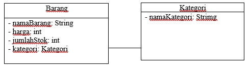
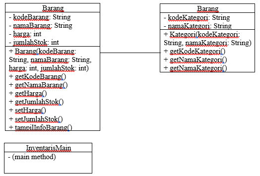

# Laporan Quiz 1

# Quiz  1

## Data Mahasiswa
Nama    : Chamillatul Luqiana Agustin

Nim     : 2241720020

Kelas   : TI-2C

### 1. Class dan Object
* Apa yang dimaksud dengan "class" dalam pemrograman berorientasi objek?

    **Jawaban:**

    Class adalah blueprint atau prototype dari objek. Class berperan sebagai template untuk menciptakan objek-objek individu yang memiliki perilaku dan properti yang sama atau serupa. Class berisi definisi atribut (properti) dan metode (fungsi) yang akan dimiliki oleh objek yang dibuat berdasarkan class tersebut.

* Bagaimana Anda mendefinisikan objek dari suatu class dalam bahasa pemrograman Java?

    **Jawaban:**

    1. Mendefinisikan Class
        ```java
        public class Mahasiswa {
            public int nim;
            public String nama;
            public String alamat;
            public String kelas;

            public void tampilBiodata() {
                System.out.println("Nim     : " + nim);
                System.out.println("Nama    : " + nama);
                System.out.println("Alamat  : " + alamat);
                System.out.println("Kelas   : " + kelas);
            }
        }
        ```
    2.	Membuat objek dari class dengan operator new.
        ```java
        Mahasiswa mhs1 = new Mahasiswa();
        ```
    3.	Mengatur nilai atribut objek menggunakan objek yang telah dibuat.
        ```java
        mhs1.nim = 101;
        mhs1.nama = "Lestari";
        mhs1.alamat = "Jl. Vinolia No 1A";
        mhs1.kelas = "1A";
        ```

        Di sini, kita menggunakan objek mhs1 yang telah dibuat sebelumnya, dan menggunakan operator titik (.) untuk mengakses atribut-atribut objek (nim, nama, alamat, dan kelas) dan mengatur nilai-nilainya sesuai dengan yang diinginkan. Inilah bagian yang mengatur nilai atribut objek menggunakan objek yang telah dibuat.
    4. Menggunakan objek, termasuk memanggil metode pada objek jika diperlukan.
        ```java
        mhs1.tampilBiodata();
        ```

        Pada langkah ini, kita menggunakan objek mhs1 yang telah dibuat sebelumnya dan memanggil metode tampilBiodata() pada objek tersebut dengan menggunakan operator titik (.). Ini adalah bagian yang menggunakannya objek dan memanggil metode pada objek jika diperlukan.

* Misalkan Anda memiliki class "Barang" dalam sistem informasi inventaris. Bagaimana Anda akan membuat objek "laptop" dari class tersebut?

    **Jawaban:**

    1. Mendefinisikan class Barang yang memiliki atribut nama, jenis, dan harga, serta metode tampilInfo() untuk menampilkan informasi barang.
        ```java
        // Langkah 1: Mendifinisikan Class Barang
        public class Barang {
            public String nama;
            public String jenis;
            public int harga;

            public void tampilInfo() {
                System.out.println("Nama  : " + nama);
                System.out.println("Jenis : " + jenis);
                System.out.println("Harga : $" + harga);
            }
        }
        ```
    2.	Membuat objek "laptop"
        ```java
        // Langkah 2: Membuat Objek "laptop" dari Class Barang
        Barang laptop = new Barang();
        ```
    3.	Mengatur nilai atribut objek "laptop" seperti nama, jenis, dan harga.
        ```java
        // Langkah 3: Mengatur Nilai Atribut Objek "laptop"
        laptop.nama = "Laptop Acer";
        laptop.jenis = "Notebook";
        laptop.harga = 800;
        ```
    4. Menggunakan objek "laptop" dengan memanggil metode tampilInfo() untuk menampilkan informasi tentang laptop ke layar.
        ```java
        // Langkah 4: Menggunakan Objek, termasuk Memanggil Metode pada Objek
        System.out.println("Informasi Laptop:");
        laptop.tampilInfo();
        ```

### 2. Encapsulation

* Jelaskan konsep encapsulation dalam pemrograman berorientasi objek dan mengapa hal ini penting dalam pengembangan sistem informasi inventaris barang.

    **Jawaban:**

    - Encapsulation adalah salah satu konsep yang digunakan untuk mengatur akses dan pengelolaan data dalam suatu class. Konsep ini menggabungkan data (variabel atau atribut) dan metode (fungsi) yang bekerja pada data tersebut menjadi satu kesatuan. Dalam encapsulation, data yang dimiliki oleh suatu objek biasanya dienkapsulasi atau dibungkus dalam tingkat akses yang disebut sebagai "private," yang berarti data tersebut tidak dapat diakses atau diubah langsung dari luar class.
    - Konsep encapsulation sangat penting dalam pengembangan sistem informasi inventaris barang dan dalam pengembangan perangkat lunak secara umum. Berikut beberapa alasan mengapa encapsulation penting dalam pengembangan sistem informasi inventaris barang:

        1. Encapsulation membantu melindungi data sensitif dalam sistem inventaris dari akses yang tidak sah dengan mengenkapsulasi data sebagai variabel private dalam class.
        2. Dengan menggunakan encapsulation, Anda dapat menerapkan validasi dan logika bisnis untuk memastikan konsistensi data dalam inventaris barang.
        3. Dengan enkapsulasi, Anda dapat mengubah implementasi internal dari class inventaris tanpa memengaruhi kode yang menggunakan class tersebut.

* Dalam konteks sistem informasi inventaris, sebutkan contoh atribut (variabel) yang harus di-encapsulate dan mengapa.

    **Jawaban:**

    Beberapa contoh atribut yang harus di-encapsulate dan alasan mengapa mereka harus di-encapsulate adalah sebagai berikut:
    -	**Harga barang**
        
        Atribut ini harus di-encapsulate karena harga barang mungkin informasi rahasia yang tidak boleh diakses atau diubah oleh pihak yang tidak berwenang. Dengan mengenkapsulasi harga sebagai variabel private, kita dapat mengendalikan akses dan memastikan bahwa harga hanya dapat diubah melalui metode yang sesuai, seperti setter, yang dapat memvalidasi perubahan harga.

    -	**Jumlah stok**
        
        Jumlah stok barang perlu di-encapsulate karena hal ini memengaruhi ketersediaan barang. Dengan mengenkapsulasi jumlah stok, kita dapat menerapkan validasi untuk memastikan bahwa stok tidak pernah negatif atau melebihi batas tertentu.

    -	**Deskripsi barang**
        
        Deskripsi barang perlu di-encapsulate karena mungkin terdapat kebijakan perusahaan yang mengatur bagaimana informasi barang diakses dan dikelola. Dengan mengenkapsulasi deskripsi, kita dapat memberlakukan aturan akses dan membatasi akses langsung ke informasi rinci tentang barang.

    -	**Nama pemilik / penanggung jawab**
        
        Informasi tentang pemilik atau penanggung jawab barang perlu di-encapsulate. Ini dapat digunakan untuk mengidentifikasi siapa yang bertanggung jawab atas barang tertentu. Dengan mengenkapsulasi informasi pemilik, kita dapat mengontrol akses ke data sensitif ini.

### 3. Relasi Kelas

* Apa yang dimaksud dengan relasi antara kelas dalam pemrograman berorientasi objek?

    **Jawaban:**

    Relasi antara kelas dalam pe mrograman berorientasi objek (OOP) mengacu pada hubungan atau interaksi yang terjadi antara dua atau lebih kelas dalam suatu sistem atau program yang menggunakan konsep OOP. Hubungan antara kelas ini menggambarkan bagaimana kelas-kelas tersebut saling berhubungan dan berinteraksi satu sama lain untuk mencapai tujuan tertentu dalam aplikasi.

* Dalam sistem informasi inventaris barang, bagaimana Anda akan menggambarkan relasi antara kelas "Barang" dan kelas "Kategori"?

    **Jawaban:**

    1.	Gambarkan kelas Barang
    2.	Gambarkan kelas Kategori
    3.	Tambahkan Atribut dalam Setiap Kelas:
        -  Di dalam kotak kelas "Barang," tambahkan atribut-atribut seperti "namaBarang," "harga," "jumlahStok," dan atribut referensi "kategori" yang akan menghubungkan ke kelas "Kategori."
        - Di dalam kotak kelas "Kategori," tambahkan atribut-atribut seperti "namaKategori" dan atribut lain yang relevan.
    4.	Hubungkan kelas dengan panah:
        - Gambar panah yang menghubungkan atribut "kategori" dalam kelas "Barang" ke kelas "Kategori." Panah ini menunjukkan hubungan antara kelas "Barang" dan "Kategori" yang mengindikasikan bahwa setiap objek dari kelas "Barang" memiliki hubungan dengan satu objek dari kelas "Kategori.".

        

        Jadi, panah yang menghubungkan atribut "kategori" dalam kelas "Barang" ke kelas "Kategori" menunjukkan relasi asosiasi antara keduanya. Hal ini menggambarkan bahwa setiap objek dari kelas "Barang" memiliki hubungan dengan satu objek dari kelas "Kategori."

### 4. PBL

* Berdasarkan kasus sistem informasi inventaris barang, coba buat sebuah class sederhana beserta atribut dan metodenya yang menggambarkan suatu entitas dalam sistem tersebut (misalnya, class "Barang").

    **Jawaban:**

    #### Class Barang
    ```java
    public class Barang {
        private String kodeBarang;
        private String namaBarang;
        private int harga;
        private int jumlahStok;

        public Barang(String kodeBarang, String namaBarang, int harga, int jumlahStok) {
            this.kodeBarang = kodeBarang;
            this.namaBarang = namaBarang;
            this.harga = harga;
            this.jumlahStok = jumlahStok;
        }

        public String getKodeBarang() {
            return kodeBarang;
        }

        public String getNamaBarang() {
            return namaBarang;
        }

        public int getHarga() {
            return harga;
        }

        public int getJumlahStok() {
            return jumlahStok;
        }

        public void setHarga(int harga) {
            this.harga = harga;
        }

        public void setJumlahStok(int jumlahStok) {
            this.jumlahStok = jumlahStok;
        }

        public void tampilInfoBarang() {
            System.out.println("Kode Barang: " + kodeBarang);
            System.out.println("Nama Barang: " + namaBarang);
            System.out.println("Harga: " + harga);
            System.out.println("Jumlah Stok: " + jumlahStok);
        }
    }
    ```

    #### Class Kategori
    ```java
    public class Kategori {
        private String kodeKategori;
        private String namaKategori;

        public Kategori(String kodeKategori, String namaKategori) {
            this.kodeKategori = kodeKategori;
            this.namaKategori = namaKategori;
        }

        public String getKodeKategori() {
            return kodeKategori;
        }

        public String getNamaKategori() {
            return namaKategori;
        }

        public void setNamaKategori(String namaKategori) {
            this.namaKategori = namaKategori;
        }
    }
    ```

    #### Class InventarisMain
    ```java
    public class InventarisMain {
        public static void main(String[] args) {
            // Membuat objek Barang
            Barang barang1 = new Barang("B01", "Laptop", 5000000, 10);
            Barang barang2 = new Barang("B02", "LCD", 10000000, 20);

            // Menampilkan informasi Barang
            System.out.println("Informasi Barang 1:");
            barang1.tampilInfoBarang();

            System.out.println("\nInformasi Barang 2:");
            barang2.tampilInfoBarang();

            // Membuat objek Kategori
            Kategori kategori1 = new Kategori("K01", "Hardware");
            Kategori kategori2 = new Kategori("K02", "Audio Visual");

            // Menampilkan informasi Kategori
            System.out.println("\nInformasi Kategori 1:");
            System.out.println("Kode Kategori: " + kategori1.getKodeKategori());
            System.out.println("Nama Kategori: " + kategori1.getNamaKategori());

            System.out.println("\nInformasi Kategori 2:");
            System.out.println("Kode Kategori: " + kategori2.getKodeKategori());
            System.out.println("Nama Kategori: " + kategori2.getNamaKategori());
        }
    }
    ```

* Bagaimana Anda akan menggunakan encapsulation untuk melindungi atribut-atribut dalam class tersebut?

    **Jawaban:**

    Pada class tersebut saya sudah menggunakan encapsulation dengan baik dalam class "Barang" dan "Kategori" untuk melindungi atribut-atribut dalam class tersebut, yaitu dengan:

    1. Mendeklarasikan Atribut sebagai Private:

        Semua atribut dalam class "Barang" dan "Kategori" telah dideklarasikan sebagai private. sehingga tidak dapat diakses atau dimodifikasi langsung dari luar class tersebut.

    2.	Menggunakan Getter dan Setter:

        Menyediakan metode getter (seperti getKodeBarang(), getNamaBarang(), getHarga(), getJumlahStok()) untuk mengambil nilai atribut privat dan setter (seperti setHarga(int harga), setJumlahStok(int jumlahStok)) untuk mengubah nilai atribut privat.

    3.	Validasi dalam Setter

        Validasi telah diterapkan dalam setter untuk memastikan bahwa nilai yang dimasukkan sesuai dan valid.

    Dengan menggunakan encapsulation seperti ini, telah meningkatkan kontrol dan keamanan data dalam class. Dengan demikian, atribut-atribut ini tidak dapat diakses atau dimodifikasi secara langsung dari luar class, dan penggunaannya harus melalui metode getter dan setter yang telah disediakan. Hal ini membantu dalam menjaga data agar tetap konsisten dan mengontrol akses ke data tersebut.

* Gambarkan hierarki class atau hubungan antar class yang mungkin ada dalam sistem informasi inventaris barang di jurusan Teknologi Informasi. Berikan contoh relasi antar class (misalnya, inheritance atau association) dalam konteks tersebut.

    **Jawaban:**

    1.	Class "Barang":
        - Representasi dari barang dalam inventaris.
        - Atribut-atribut seperti kode barang, nama barang, harga, jumlah stok, dll.
    2.	Class "Kategori":
        -	Representasi dari kategori barang.
        -	Atribut-atribut seperti kode kategori, nama kategori, dll.
    3.	Class "InventarisMain":
        -	Class yang berfungsi sebagai titik awal eksekusi program.
        -	Digunakan untuk membuat objek-objek "Barang" dan "Kategori," serta menampilkan informasi tentang barang dan kategori.

    Hubungan antar class adalah sebagai berikut:
    -	"Barang" memiliki hubungan asosiasi dengan "Kategori," yang direpresentasikan dengan atribut "kategori."

    


