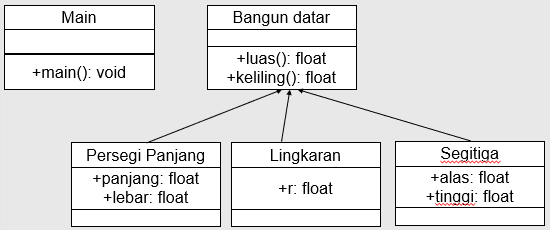
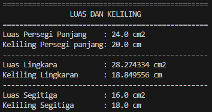

# Laporan Tugas Pertemuan 6

# Tugas 6: Inheritance (Pewarisan)

## Data Mahasiswa
Nama    : Chamillatul Luqiana Agustin

Nim     : 2241720020

Kelas   : TI-2C

# Soal
Tuliskan program yang berfungsi untuk menghitung luas dan keliling bangun datar



**Jawaban:**

### KODE PROGRAM

#### Class BangunDatar
```java
package TugasTeori;

public abstract class BangunDatar {
    public abstract float luas();
    public abstract float keliling();
}
```

#### Class PersegiPanjang
```java
package TugasTeori;

public class PersegiPanjang extends BangunDatar {
    private float panjang;
    private float lebar;

    public PersegiPanjang(float panjang, float lebar) {
        this.panjang = panjang;
        this.lebar = lebar;
    }

    public float luas() {
        return panjang * lebar;
    }

    public float keliling() {
        return 2 * (panjang + lebar);
    }
}
```

#### Class Lingkaran
```java
package TugasTeori;

public class Lingkaran extends BangunDatar {
    private float r;

    public Lingkaran (float r) {
    this.r = r;
    }

    public float luas() {
        return (float) (Math.PI * r * r);
    }

    public float keliling () {
        return (float) (2 * Math.PI * r);
    }
}
```

#### Class Segitiga
```java
package TugasTeori;

public class Segitiga extends BangunDatar {
    private float alas;
    private float tinggi;
    private float miring;

    public Segitiga(float alas, float tinggi, float miring) {
        this.alas = alas;
        this.tinggi = tinggi;
        this.miring = miring;
     }

    public float luas() {
        return 0.5f * alas * tinggi;
    }

    public float keliling () {
        return alas + tinggi + miring;
    }
}
```

#### Class Main
```java
package TugasTeori;

public class Main {
    public static void main(String[] args) {
        PersegiPanjang pp = new PersegiPanjang(6, 4);
        Lingkaran lingkaran = new Lingkaran(3);
        Segitiga segitiga = new Segitiga(4, 8, 6);

        System.out.println("=================================================");
        System.out.println("\t\tLUAS DAN KELILING\t\t");
        System.out.println("=================================================");

        System.out.println("Luas Persegi Panjang\t: " + pp.luas() + " cm2");
        System.out.println("Keliling Persegi panjang: " + pp.keliling() + " cm");
        System.out.println("-------------------------------------------------");
        System.out.println("Luas Lingkara\t\t: " + lingkaran.luas() + " cm2");
        System.out.println("Keliling Lingkaran\t: " + lingkaran.keliling() + " cm");
        System.out.println("-------------------------------------------------");
        System.out.println("Luas Segitiga\t\t: " + segitiga.luas() + " cm2");
        System.out.println("Keliling Segitiga\t: " + segitiga.keliling() + " cm");
    }
}
```

### OUTPUT
