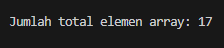
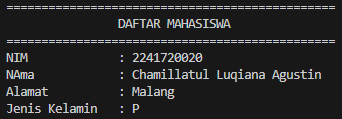
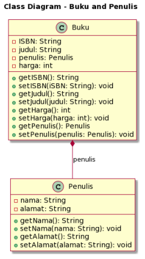
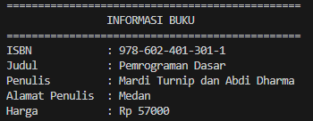

# Laporan Ujian Tengah Semester

# Ujian Tengah Semester

## Data Mahasiswa
Nama    : Chamillatul Luqiana Agustin

Nim     : 2241720020

Kelas   : TI-2C

# Soal 1: Penulisan Class
Berdasarkan contoh class ClassA di bawah ini, jelaskan apakah penulisan source code pada contoh class tersebut sudah benar. Jika tidak, apa yang perlu diperbaiki?
```java
public class ClassA {
    float f1 = 0.15f;

    float hitung() {
    float x = 2f * f1;
    }
}
```

## Jawaban:

Penulisan source code pada contoh class tersebut tidak benar, karena  terdapat kesalahan di mana metode hitung() dideklarasikan untuk mengembalikan nilai float, tetapi dalam implementasinya, tidak ada nilai yang dikembalikan.

Sehingga untuk memperbaikinya perlu menambahkan pernyataan return dalam metode hitung() untuk mengembalikan nilai. Dengan perubahan ini, implementasi metode sesuai dengan deklarasi pengembalian float.

Jadi, perubahan yang diperlukan adalah menambahkan pernyataan return agar metode hitung() mengembalikan nilai, sehingga class ClassA dapat berfungsi dengan benar.

### Perbaikan:
```java
public class ClassA {
    float f1 = 0.15f;
    
    float hitung() {
    float x = 2f * f1;
    return x; // Mengembalikan nilai x
    }
}
```


# Soal 2: Perhitungan Jumlah Elemen Array 2 Dimensi
Pada class SoalArray1, terdapat array 2 dimensi dengan ukuran 3x3. Tuliskan code Java untuk menghitung jumlah total elemen array tersebut dengan menggunakan perulangan.
```java
public class SoalArray1 {
    public static void main(String[] args) {
        int[][] arrayInt = {{1, 1, 4}, {2, 1, 2}, {3, 2, 1}};
        // hitung jumlah elemen array 2 dimensi
        // gunakan perulangan
    }
}
```

## Jawaban:
### Kode Program
```java
// Menghitung jumlah total elemen array
public class SoalArray1 {
    public static void main(String[] args) {
        int[][] arrayInt = {{1, 1, 4}, {2, 1, 2}, {3, 2, 1}};
        int total = 0;

        for (int i = 0; i < arrayInt.length; i++) {
            for (int j = 0; j < arrayInt[i].length; j++) {
                total += arrayInt[i][j];
            }
        }

        System.out.println("Jumlah total elemen array: " + total );
    }
}
```

### Output



# Soal 3: Pewarisan Atribut dan Method
Pada source code yang diberikan, class ClassY merupakan turunan dari class Class. Sebutkan atribut dan method apa saja yang diwarisi oleh ClassY dari kelas induknya (class Class). Jelaskan juga apa output dari code yang ditulis pada class ClassY dan bagaimana nilai tersebut diperoleh.
```java
public class Class {
    int a = 2;
    int x = 0;

    int hitung() {
        x = x + 5 * a;
        return x;
    }
}
```
```java
public class ClassY extends Class {
    int b = 5;
    int y = 0;
    int hitungY() {
        y = hitung() * b;
        return y;
    }

public static void main(String[] args) {
    ClassY cy = new ClassY();
    System.out.println(cy.hitungY());
    }
}
```

## Jawaban:
Atribut yang diwarisi oleh ClassY dari kelas induknya (class Class):
- a: Atribut a dengan nilai 2.
- x: Atribut x dengan nilai 0.

Atribut yang diwarisi oleh ClassY dari kelas induknya (class Class):
- hitung(): Method hitung() mengubah nilai x dengan menambahkannya dengan hasil perkalian 5 dan a. Method ini mengembalikan nilai x yang baru.

### Output


# Soal 4: Class Mahasiswa dengan Constructor
Dalam class Mahasiswa, lengkapi code dengan:

a. Menambahkan constructor untuk mengisi atribut nim, nama, alamat, dan jenisKelamin.

b. Membuat objek mahasiswa dan mengisi atribut nim, nama, alamat, dan jenisKelamin melalui constructor.
```java
public class Mahasiswa {
    String nim, nama, alamat;
    char jenisKelamin;
 
    // a. Tambahkan constructor
    // Gunakan constructor untuk
    // mengisi atribut nim, nama, alamat, jenisKelamin
 
    public static void main(String[] args) {
        // b. Buat objek mahasiswa
        // Isi atribut nim, nama, alamat, jenisKelamin
        // lewat constructor
    }
}
```

## Jawaban:
### Kode Program
```java
package Soal4;

public class Mahasiswa {
    String nim, nama, alamat;
    char jenisKelamin;
 
    // a. Tambahkan constructor
    // Gunakan constructor untuk
    // mengisi atribut nim, nama, alamat, jenisKelamin
    public Mahasiswa(String nim, String nama, String alamat, char jenisKelamin) {
        this.nim = nim;
        this.nama = nama;
        this.alamat = alamat;
        this.jenisKelamin = jenisKelamin;
    }
 
    public static void main(String[] args) {
        // b. Buat objek mahasiswa
        // Isi atribut nim, nama, alamat, jenisKelamin
        // lewat constructor
        Mahasiswa mhs = new Mahasiswa("2241720020", "Chamillatul Luqiana Agustin", "Malang", 'P');

        System.out.println("===============================================");
        System.out.println("\t\tDAFTAR MAHASISWA\t\t");
        System.out.println("===============================================");
        System.out.println("NIM\t\t: " + mhs.nim);
        System.out.println("NAma\t\t: " + mhs.nama);
        System.out.println("Alamat\t\t: " + mhs.alamat);
        System.out.println("Jenis Kelamin\t: " + mhs.jenisKelamin);
    }
}
```

### Output



## Soal 5: OOP Buku -> Penulis
Perhatikan class diagaram berikut dan Buatlah Source code dalam Bahasa java berdasarkan class diagram tersebut



### Jawaban:
### Kode Program
### Class Penulis
```java
package Soal5;

public class Penulis {
    private String nama;
    private String alamat;

    public String getNama() {
        return nama;
    }

    public void setNama(String nama) {
        this.nama = nama;
    }

    public String getAlamat() {
        return alamat;
    }

    public void setAlamat(String alamat) {
        this.alamat = alamat;
    }
}
```

### Class Buku
```java
package Soal5;

public class Buku {
    private String ISBN;
    private String judul;
    private Penulis penulis;
    private int harga;

    public String getISBN() {
        return ISBN;
    }

    public void setISBN(String ISBN) {
        this.ISBN = ISBN;
    }

    public String getJudul() {
        return judul;
    }

    public void setJudul(String judul) {
        this.judul = judul;
    }

    public Penulis getPenulis() {
        return penulis;
    }

    public void setPenulis(Penulis penulis) {
        this.penulis = penulis;
    }

    public int getHarga() {
        return harga;
    }

    public void setHarga(int harga) {
        this.harga = harga;
    }
}
```

### Class Main
```java
package Soal5;

public class Main {
    public static void main(String[] args) {
            // Membuat objek Penulis
            Penulis penulis = new Penulis();
            penulis.setNama("Mardi Turnip dan Abdi Dharma");
            penulis.setAlamat("Medan");
    
            // Membuat objek Buku
            Buku buku = new Buku();
            buku.setISBN("978-602-401-301-1");
            buku.setJudul("Pemrograman Dasar");
            buku.setPenulis(penulis);
            buku.setHarga(57000);
    
            // Menampilkan informasi buku
            System.out.println("===============================================");
            System.out.println("\t\tINFORMASI BUKU\t\t");
            System.out.println("===============================================");
            System.out.println("ISBN\t\t: " + buku.getISBN());
            System.out.println("Judul\t\t: " + buku.getJudul());
            System.out.println("Penulis\t\t: " + buku.getPenulis().getNama());
            System.out.println("Alamat Penulis\t: " + buku.getPenulis().getAlamat());
            System.out.println("Harga\t\t: Rp " + buku.getHarga());
    }
}
```

### Output
